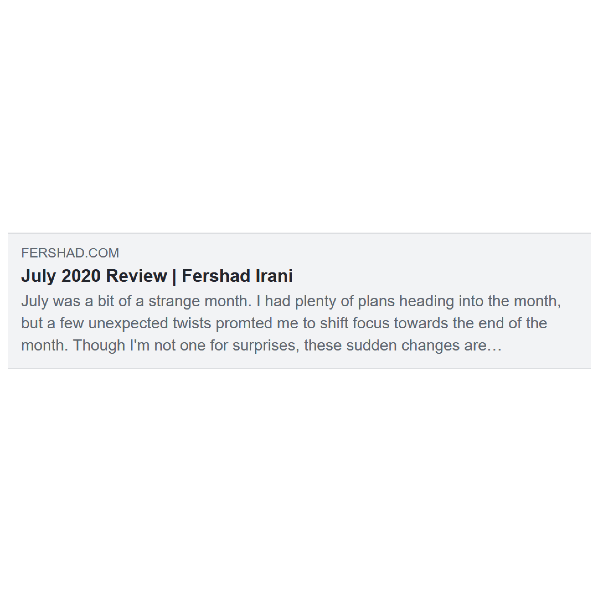

There may only be a handful of people out there who read every single post that's on their Facebook, Twitter or LinkedIn feed. Most of us just scroll through, giving the content a casual glance as we go by. But as content creators, we ideally want people to notice and click through to our content when it is shared on social media platforms, or even through chat apps. How can we help achieve that?

One way that can help boost the visibility of our content is by using Open Graph meta tags on our web pages.

## What is Open Graph?

Open Graph is a protocol that was developed by Facebook in the early 2010s. By including just a few lines of code into the `<head>` tag of a web page, Open Graph allows us to share "rich objects" with websites our content is shared on. In this way, web page creators can provide social media platforms with specific information about the page and how it should be displayed to users of that platform.

Though it was first developed by Facebook, the Open Graph protocol has been widely adopted as the standard for social sharing. Twitter, LinkedIn, and even chat apps like WhatsApp and LINE all support it.

Facebook has published a whole lot more information on the [protocol specifics](https://developers.facebook.com/docs/sharing/webmasters/). In this article we'll be going through the four key tags that you _really should_ include on all of your pages. We'll also touch on some extra tags that help provide sites more context.

## How can Open Graph improve branding & engagement?

When a web page doesn't have Open Graph meta tags it's left up to the social networks & apps to decide what content they feel is appropriate to show when the page is shared. This leads to an inconsistent appearance across different channels, and also poor presentation in general.

Consider the blog post below. Without Open Graph tags on the page, Facebook might choose to show it like this:

That's not very attractive, doesn't include any branding, and is almost certainly going to be overlooked by the vast majority of people who have it added to their Facebook feed.

With some Open Graph tags added to the page, we get a presentation that's more likely to catch the attention of people scrolling through their Facebook feed.

So what tags do we need to add to our page to get our shared posts looking like this? There are four key tags to include, plus a few of extra ones specifically for Twitter.

> Without using Open Graph tags you're leaving it completely up to the social media providee or chat app to decide what content and image (if any) are relevant to include with a shared page. That's not ideal when you want to have consistent branding of your content across multiple channels.

## Key Open Graph meta tags

From here on we'll be referring to Open Graph by its acronym _OG_. The four key OG tags you should include in the `<head>` block of your web pages are:

- **OG Image** - This sets the image that is shown by social networks.
- **OG Title** - The title that will be shown for the page.
- **OG Description** - A short description of the page.
- **OG URL** - The URL that you want the shared post to link to.

Let's stick with the July 2020 Review blog post I've used above. What do the OG tags for this post look like?

<!-- markdownlint-disable -->

    <meta property="og:title" content="July 2020 Review | Fershad Irani">
    <meta property="og:url" content="https://www.fershad.com/blog/posts/july-2020-review/">
    <meta property="og:image" content="https://www.fershad.com/ogImages/post-july-2020-review.png">
    <meta property="og:description" content="July was a bit of a strange month. I had plenty of plans heading into the month, but a few unexpected twists promted me to shift focus towards the end of the month. Though I'm not one for surprises, these sudden changes are undoubtedly for the better.">

<!-- markdownlint-enable -->

In the above, my description text is a bit long and so would almost certainly be truncated when shown with the other OG content. This is something to keep in mind when creating your own material.

The most important tag for displaying the eye-catching, large visual is the `og:image` tag on line 3 of the code above. Without this we're leaving it up to the social network/app to decide this they want to show an image for the post at all. If they do decide to, then without an `og:image` set we're leaving it up to chance as to what image is displayed. That's not ideal, especially if we want to create consistent branding on our content that's shared across multiple channels.

There are a few more things to keep in mind when creating OG images which we'll touch on at the end of this post. Before that, we're going to quickly go through some extra OG tags that you can (and really should) include on your pages.

## Additional Open Graph meta tags

The four tags shown above provide enough information to the website/app that your content is shared on to let them display content the way you want. There are some additional tags you can use to give these sites even more context that they can associate to your content.

Again these tags should all go within the `<head>` block of your web page code.

- **OG Type** - A categorisation of the type of object (content) you are sharing. You can find a [full list of types here](http://ogp.me/#types). Facebook will default to the "website" type if none is provided.
- **OG Locale** - This lets you define the language of the content. "en_US" is the default.
- **OG Site Name** - Allows you to specify the name of your site.
- **OG Audio** - Lets you link to an audio track related to the shared page.
- **OG Video** - Lets you link to a video file related to the shared page.
- **OG Image Alt** - Assigns alt text to your shared image. This is especially important for accessibility.

Adding this to the basic code earlier would give us the below. Please note that the Audio & Video elements below are not real in this case.

<!-- markdownlint-disable -->

    <!-- Key OG tags -->
    <meta property="og:title" content="July 2020 Review | Fershad Irani">
    <meta property="og:url" content="https://www.fershad.com/blog/posts/july-2020-review/">
    <meta property="og:image" content="https://www.fershad.com/ogImages/post-july-2020-review.png">
    <meta property="og:description" content="July was a bit of a strange month. I had plenty of plans heading into the month, but a few unexpected twists promted me to shift focus towards the end of the month. Though I'm not one for surprises, these sudden changes are undoubtedly for the better.">

    <!-- Additional OG tags -->
    <meta property="og:type" content="article">
    <meta property="og:locale" content="en_GB" />
    <meta property="og:site_name" content="Fershad Irani">

    <meta property="og:audio" content="https://www.fershad.com/example.mp3" />
    <meta property="og:video" content="https://www.fershad.com/example.mp4" />
    <meta property="og:image:alt" content="Page image for July 2020 Review">

<!-- markdownlint-enable -->


Twitter actually has its own sharing standard, but does use OG meta tags when that standard is not provided. There are a couple of extra lines of code you can add to make sure your content is well presented when shared on Twitter.

<!-- markdownlint-disable -->

    <!--
    Additional tags for Twitter
    Add this to the OG tags shown previously in this post.
        -->
    <meta name="twitter:card" content="summary_large_image">
    <meta name="twitter:image" content="https://www.fershad.com/ogImages/post-july-2020-review.png">
    <meta name="twitter:image:alt" content="Page image for July 2020 Review">
    <meta name="twitter:description" content="July was a bit of a strange month. I had plenty of plans heading into the month, but a few unexpected twists promted me to shift focus towards the end of the month. Though I'm not one for surprises, these sudden changes are undoubtedly for the better.">

<!-- markdownlint-enable -->

Using `summary_large_image` to define the content of the card here will tell Twitter to show a large version of the image, similar to what we get on Facebook.



## Guidelines for creating useable images for Open Graph

Before wrapping up I'd like to give you (or your creative team) some simple guidelines to follow when creating images that you will use for social sharing. This will be a quick summary, Facebook has a [full specification](https://developers.facebook.com/docs/sharing/webmasters/images) that you can look at too.

- Make sure the image is hosted publicly (so that other sites can access it)
- Use a widely supported image format (JPEG or PNG are good choices)
- The recommended aspect ratio is 1.91/1
- The minimum size for a large image is 600 x 315 pixels (1200 x 630 pixels is recommended)


Both Facebook & Twitter have tools that allow you to enter a URL and show you a preview of the Open Graph content for that web page.

- [Facebook Sharing Debugger](https://developers.facebook.com/tools/debug/)
- [Card Validator](https://cards-dev.twitter.com/validator)



## Conclusion

Using Open Graph tags in your web page code, and sharing them with well-composed images is an easy way to make your content stand out to users scrolling through their social media feeds. Besides being a way to boost click-through from shared content, it is also the easiest way to ensure branding remains consistent as your content is shared over multiple online channels.

You can use the OG and Twitter card tags I've provided above can help you take the first steps towards boosting user engagement with the content you/your brand shares on social media. If you need a hand then [get in touch](https://www.fershad.com/contact/).
