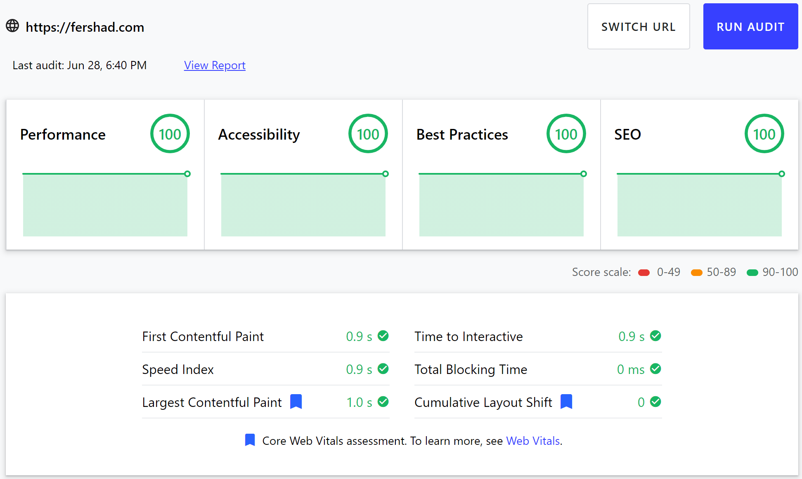

This website is my home on the internet. It's a place where people can get to know me as a person, and as a professional. This was front of mind when I decided to give the site a redesign in May 2021. Besides being a place to highlight the things I've worked on, I also wanted the site to embody something that I truly care about - sustainability.

The environmental impact of our digital lives is growing rapidly. I've [written about it](https://fershad.com/writing/the-environmental-case-for-website-performance/) previously on my blog. To be honest, I wasn't fully aware just how much of a negative impact digital was having on our planet until early in 2020. My moment of enlightenment came when reading Gerry McGovern's book [World Wide Waste](https://gerrymcgovern.com/books/world-wide-waste). Since then, I've sought to continue understanding more about digital sustainability, particularly in relation to the web.

When I started planning out the redesign of this site I wanted to ensure I applied as many [sustainable design and development](https://sustainablewebdesign.org/) principles as possible. I also wanted to ensure the site was as fast and performant as I could make it. This case study looks at some of the decisions I made during the planning and development of the redesigned website.


Through this article you will see these two icons next to some of the headings/bullet points.

- 💚 signifies something that helps with website sustainability
- 🚀 indicates something that helps with website performance



## Jamstack FTW

This website has used Jamstack architecture for a long time. It is a "static site" if you really want to categorise it. Each page you visit is pre-rendered in a build process before the whole site goes live. This build process runs each time site content is updated and committed to GitHub. Since I'm not frequently updating content, this approach works just fine. I can live with waiting a couple of minutes for a new blog post or code change to go live. This approach doesn't work for every website. It does, however, allow me to implement many website performance and sustainability optimisations directly to the site before it ships. I'll get onto those shortly.

### Built with Eleventy

Like the previous iteration, I've stuck with [Eleventy (11ty)](https://www.11ty.dev/) as the static-site generator (SSG) that builds this site. One of the Eleventy features I lean on most heavily to ensure this site is fast and sustainable are _Transforms_. These allow developers to modify the output of an Eleventy template. I've used transforms for several of the performance and sustainability optimisations I talk about later such as finding and handling critical CSS, applying image placeholders, and creating a simple table of content for blog posts.


If you're interested in learning more about Eleventy then I strongly recommend this (now free!!) course by Andy Bell - [Learn Eleventy From Scratch](https://piccalil.li/course/learn-eleventy-from-scratch/).

_This is not a paid ad or affiliate link. I took this course when it first launched and am recommending it from my own experience._


### Hosting on Cloudflare Pages

Being a static site, each page of my website is a simple HTML file. This means that I can host my site virtually anywhere. However, one of the benefits of a Jamstack approach is integration with a CI/CD (Continuous Integration/Continuous Deployment) pipeline. This allows a new site build to be automatically triggered whenever code or content changes. I could try building that process myself, but several hosting providers offer it out-of-the-box for static sites like mine.

Cloudflare Pages is one of the newest entrants into the Jamstack hosting space. Leveraging Cloudflare's global CDN, it is the first set of key performance and sustainability wins for this site.

- 💚🚀 Cloudflare's global CDN means reduced latency when serving data to site visitors. It also means data travels a shorter distance to reach the user. This minimises energy usage on the network.
- 💚🚀 Enabling Brotli compression reduces the size of static assets, further minimising energy usage when serving the site. The smaller sizes also mean downloading the assets takes less time.
- 💚 [Cloudflare neutralises the carbon footprint](https://blog.cloudflare.com/the-climate-and-cloudflare/) of its global operations through Renewable Energy Certificates (RECs). While running on 100% renewable energy is the best possible approach, Cloudflare is still taking a step in the right direction here.

## Image optimisations

I tend not to use video in my content, so images are the heaviest assets on my site. Optimising them goes a long way towards ensuring each page on this site loads fast and has as small of an environmental footprint as possible.

### 💚🚀 Serving modern formats

Using modern image formats like WebP or AVIF is arguably the easiest way to go about reducing image size. For my site, I use [Cloudinary](https://cloudinary.com/invites/lpov9zyyucivvxsnalc5/dyg8fkjzrzhfeiqce9nl) (_affiliate link_) to do most of the heavy lifting. With very little effort I'm able to serve AVIF images to browsers that support it, WebP to those that don't, and JPEG as a fallback. Most of the traffic to my site comes from Google Chrome users, so they're being served AVIF. Since the size of these images is much smaller than JPEG they are downloaded faster. Once again, their small size also reduces the energy required to transfer them over the network.

As a further step, I upload and process images using Cloudinary only as and when they are needed. Using Cloudinary's [_remote image fetch URL_](https://cloudinary.com/documentation/fetch_remote_images#remote_image_fetch_url) I'm able to keep a local version of each image, which is only uploaded & processed by Cloudinary when it is first requested. Subsequent requests for that image are then served from Cloudinary's cache. I've also added an [extra layer of caching using Cloudflare](https://github.com/wesbos/cloudflare-cloudinary-proxy). This helps keep my usage well within Cloudinary's free tier.

### 💚🚀 Delivering appropriately sized images

Presenting users with images that are appropriately sized for their viewport/device/screen is another performance and sustainability gain. Rather than making a mobile user download a 1600px wide hero image, they're served a 320px wide image instead (640px for retina displays). Again, this reduces the size of the files downloaded by the user. And yep, you guessed it, this approach also requires less electricity to transfer over the network.

Delivering responsive images can be rather tedious to do by hand. Thankfully the [Eleventy Image Plugin](https://www.11ty.dev/docs/plugins/image/) handles all of this for me. By just passing in the original image alongside some parameters for sizing the plugin creates local, resized copies for each image. It also injects the required HTML directly into each page.

### Other image optimisations

- 💚🚀 I lazy-load images as much as possible using the native `loading="lazy"` attribute. This means users aren't forced to download images further down the page until they need to see them. For some images that I know will always appear "above-the-fold", I use `loading="eager"` to help the browser prioritise them.
- 🚀 Using the `decoding="async"` attribute on all images means they're processed off the main thread by the browser. This means they won't block JavaScript from executing, and shouldn't impact page usability while images load.
- 💚🚀 The Eleventy Image Plugin generates resized images with _immutable_ file names. This means that any time the image is changed, the name will too. With this I'm able to set very aggressive caching for images.
- 🚀 On each image, I include `height` and `width` attributes. These allow modern browsers to imply the space that should be reserved for the image before it loads. This helps to prevent Cumulative Layout Shift.

## 💚🚀 Minify all the things

I include a couple of code minification steps as part of the build process for this site. As the name suggests, minification of code makes it smaller and results in less data needing to be transferred. Minification steps on this site include:

- Minify JS
- Minify CSS (both inline CSS & external stylesheets)
- Minify HTML

## 🚀 Critical & non-critical CSS

During the build process of my site, all the CSS is dumped into one temporary file. I then have a build step that looks at the HTML output of each page individually and uses the [Critical](https://github.com/addyosmani/critical) package to inline any critical CSS directly into the HEAD of that page. This process allows the browser to quickly find and parse the minimum CSS required to render the content that a visitor will first see on any given page.

What this also allows me to do is then to take the remaining (non-critical) CSS, and perform a further optimisation step. Once the critical CSS for a page has been inlined into the HTML, I then take the remaining non-critical CSS and pass it through [PurgeCSS](https://github.com/FullHuman/purgecss). PurgeCSS looks at the HTML output of the page and finds what non-critical CSS rules will be required. Those rules are then saved in a hashed file, and a `<link>` tag referencing that file is added to the page.

This entire process has several benefits:

- The page renders sooner since the critical CSS comes along with the initial HTML document.
- Purging the remaining CSS of rules that are not required for a given page significantly reduces the amount of CSS shipped. The smaller files are faster to download and parse.
- Since the non-critical CSS is saved with a hashed filename it automatically becomes immutable. This allows me to set very aggressive caching rules knowing that any change to a page's CSS will bust the cache by changing the filename.

## 🚀 Using instant.page

To make navigation around the site even faster I've used the [Instant.page](http://instant.page) script. Anytime a visitor to the site hovers over a link, Instant.page intercepts that request and begins preloading the page that is linked. By the time the click (or touch) action is finished, the content for the next page has already started to load (sometimes it may even have finished loading!), making page navigation feel really fast!


Because the Instant.page script begins to download content for a page before it is viewed, there is the prospect that a user could hover over a lot of links without visiting any. This would result in unused content being downloaded. While that might happen, the other optimisation steps I've taken on the site aim to ensure content downloaded is kept to a minimum.


## 💚🚀 Using less JavaScript

JavaScript is one of the main reasons for performance issues on websites. I'm not saying that it's bad, but just that it has to be used carefully.

From a performance perspective, poorly implemented JavaScript can result in layout shifts, late loading resources, and can block the main processing thread which can lead to the browser becoming unresponsive to interactions.

From a sustainability perspective, using just the JavaScript I require for each page results in less data being transferred, and less computational power being used by the user's device.

Most pages on my website ship with < 20kB of JavaScript. Some blog pages have lazy-loaded Codepen embeds adding ~50kB more JavaScript on those pages alone.

On my site, I only load JavaScript for the following:

- Website analytics (I [use Fathom Analytics](https://usefathom.com/ref/CEHKLY) - _affiliate link_).
- Measuring the carbon footprint of each pageview (I cover this a bit later on).
- [Instant.page](http://instant.page) (see above) requires JavaScript to function.
- On content pages to provide a share link on supported browsers using the navigator share API.
- On content pages to render and update the reading progress scrollbar at the top of the window.

Where pages might require some dynamic data, [I've used Cloudflare Workers](https://fershad.com/writing/dynamic-page-content-with-cloudflare-workers/) to generate this at the time the page is requested. This means the dynamic parts of the page are built on Cloudflare's edge network. As a result, I avoid shipping additional JavaScript files to visitors on those pages. Examples of where I've used this approach are:

- Randomly displaying a testimonial on the [Services page](https://fershad.com/services/).
- Fetching the latest website carbon data on the [Carbon page](https://fershad.com/carbon/).

## 💚 Table of content for posts

Making it quicker and easier for visitors to find information is a key part of sustainable website design. Each pageview a website visitor makes while searching for information is extra data and electricity that could otherwise be avoided.

Adding a small table of content for blog posts and case studies on my website is a first step for me in terms of making this site even easier to navigate. I create this table for each page during the site's build process. Using JavaScript, I look at the HTML output of each page, identify all the 2nd level headings (`<H2>`) and then build out the table of content linking to each section.

This is a small improvement from the previous version of my site, but should hopefully make content easier to find in long-form posts (like this one!).

## 💚 Tracking site carbon emissions

At the bottom of every page on this website is a Website Carbon measurement. It uses the [**Website Carbon calculator**](https://websitecarbon.com/) by Wholegrain Digital to give an estimate of the carbon emissions produced by a given page.

For each pageview, I save the estimated carbon emissions to an [Airtable](https://airtable.com/invite/r/1p0yKl4x) base (_affiliate link_). This allows me to sum all estimated emissions over the life of the site. I can use this data to analyse and improve the most polluting pages of my site, or even offset the emissions associated with operating the site (which is something I plan on doing).

Currently, Website Carbon Calculator records CO2 generated on page load, not accounting for lazy-loaded images and scripts. I'm planning on building my own calculator that recalculates emissions as a user interacts with a page. This will improve the accuracy of the data in the long run.


I've been having some issues with the Website Carbon API over recent weeks. For the time being I have stopped using it to track emissions on each page until I can build my own lightweight calculator.


## Still room to improve

I still feel there's room for me to improve this site - especially from a sustainability perspective. Performance-wise, the site scores 100s on Google Lighthouse tests and passes all Core Web Vital metrics.

On the sustainability front, there are a few areas I can still address that would lead to reduced data and energy usage. These are:

- 💚 **Search** - Adding search functionality to this site would make it much, much easier for visitors to find information. This is especially true for the [**Writing**](https://fershad.com/writing/) section which has several pages worth of posts at this stage.
- 💚 **Dark mode** - A dark mode would help give visitors a slight energy saving, especially on mobile devices. That said, there is [research out there](https://www.howtogeek.com/423717/dark-mode-isn%E2%80%99t-better-for-you-but-we-love-it-anyway/) that points to light text on dark backgrounds being harder for reader's to focus on. Since my site is mostly text content, it's something I'm still considering.
- 💚🚀 **Removing more unused JS** - Even though I'm already shipping very little JavaScript, there's still a bit more I can shave off. Ideally, most pages would eventually have around 10kB of JavaScript.
- 💚 **More accurate CO2 measurement** - As mentioned earlier, including lazy-loaded images and scripts in the CO2 measurements on each page is something that I'm looking into.
- 💚 **Green hosting** - Look into moving website hosting to a green hosting provider, while keep Cloudflare as my CDN. If you know a green web host that can provide CI/CD for a static website, [let me know](mailto:itsfish@fershad.com)!
