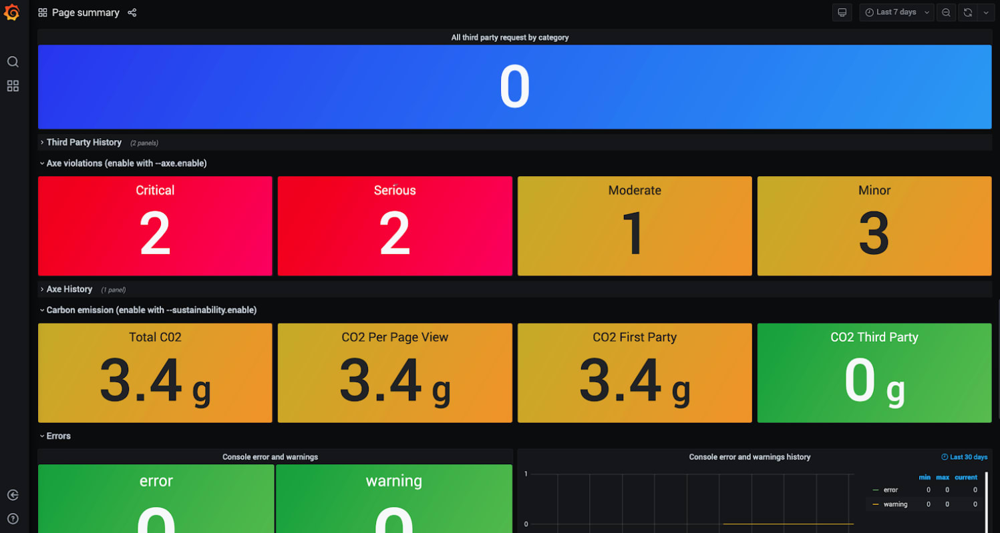
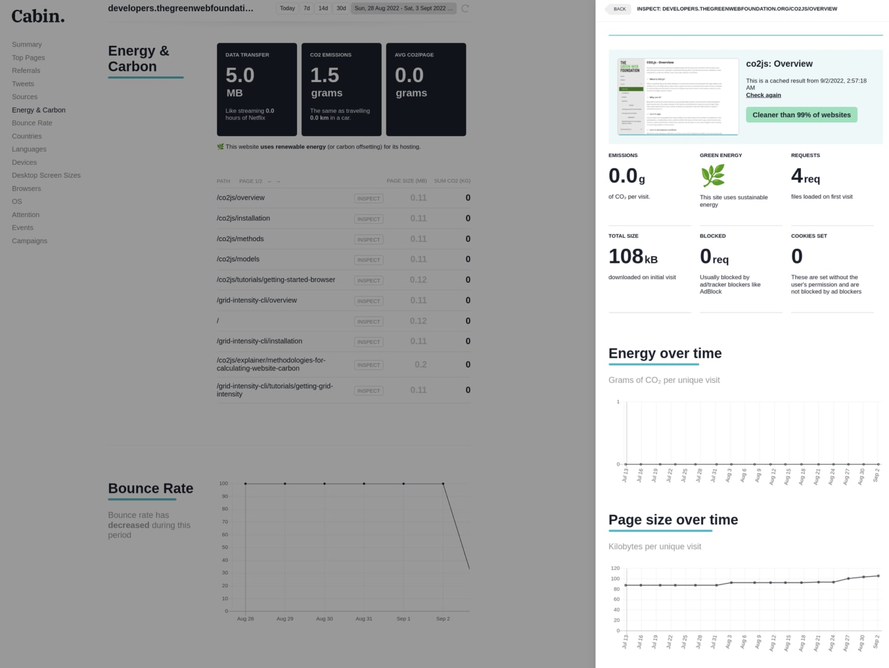


This article was originally published in [ClimateAction.tech's Branch Magazine](https://branch.climateaction.tech/issues/issue-4/co2js/).


Uploading and downloading the bits and bytes that make up the internet uses _a lot_ of electricity. Breaking the internet down to a systems level, data transfer over networks accounts for an [estimated 14% of the web’s total electricity](https://sustainablewebdesign.org/calculating-digital-emissions/) consumption. Networks are also globally distributed, meaning that the bytes you downloaded to render this web page in your browser are probably passed through several different electricity grids. Those grids are made up of different mixes of green and fossil fuel energy.

Being able to measure and account for the emissions of digital services is increasingly important, especially as carbon emissions reporting becomes a mandated part of business operations. Outside of the corporate space, consumers are also increasingly demanding greater visibility of CO2 information for the goods and services they use.

In order to meet the growing demands for reporting and transparency, developers need a way to measure the carbon emissions associated with the apps, sites, and software they build. On the server side, we’re seeing more providers build carbon reporting into their platforms. However, on the application side, it’s largely up to developers themselves to implement solutions. That’s where libraries like CO2.js come in handy, providing a set of research-based, standard calculations that enable developers to quickly add carbon awareness to their products and projects.

## What is CO2.js?

[CO2.js](https://github.com/thegreenwebfoundation/co2.js) is a JavaScript library that allows developers to estimate the emissions associated with their apps, websites and software. At its core, CO2.js takes an input of data, in bytes, and returns an estimate of the carbon emissions produced to move that data over the internet. It can be run in Node.js server environments, in the browser, as well as on some serverless and edge compute runtimes.

## **Why use it?**

Being able to estimate the carbon emissions associated with digital activities can be of benefit to both development teams and end users. The carbon emissions of the internet are something that is abstract, and out of sight. Using CO2.js allows these emissions to be surfaced, visualised, and presented in ways that make it easier for people to comprehend and act on.

The possible uses for CO2.js are wide and varied. It can be used in user-facing applications to give visibility to the carbon impact of user activity in the application. Users uploading files, or downloading content, could be notified of the impacts of those tasks. Large, carbon-intensive, data transfers could also be blocked or limited. Users could also have the option to set a carbon budget for their browsing or use of an app, website, or online service.

Behind the scenes, developers could look to use CO2.js as part of their deployment workflow. In the same way that web developers might set a _performance budget_ for their site, [a carbon budget could also be used](https://css-tricks.com/reduce-your-websites-environmental-impact-with-a-carbon-budget/). If a website or app exceeds a threshold for carbon intensity, then an alert can be raised or a new deployment can be blocked. The data from CO2.js can also be used as part of internal monitoring tools and dashboards.

Office managers and sustainability teams could also use CO2.js to track the carbon intensity of data usage within an office environment. Plugging network data usage into CO2.js can allow for monitoring and reporting on the digital usage footprint of an organisation or business.

## CO2.js today

CO2.js can do more than _just_ estimate the carbon impact of data transfer on the internet. It also includes functions that use The Green Web Foundation’s _greencheck_ API to determine if a website or domain is hosted on a green web host.

In the wild, the CO2.js package already receives close to 2000 weekly downloads on NPM. It is actively used by website testing tools like [Ecograder](https://ecograder.com/), and performance tools like [SiteSpeed.io](http://sitespeed.io/) to track and display website carbon emissions for users. Website analytics service [Cabin](https://withcabin.com/) also use CO2.js to calculate emissions for page views and historical analysis of CO2 for each page.

CO2.js is covered by an Apache 2.0 license. This allows for the library to be used in digital tools and services. Since the [code is kept on GitHub](https://github.com/thegreenwebfoundation/co2.js), and is also open for anyone to review, fork, modify, and contribute to. As we’ll touch on a little later, any datasets and figures used in CO2.js are also open, keeping with the themes of open-source, open data, and Open Climate.

### Models available for estimating digital carbon

There are a few different models that can be used to measure digital carbon emissions. CO2.js includes two of these – the OneByte model, and the Sustainable Web Design model.

#### Sustainable Web Design

By default, CO2.js uses the [Sustainable Web Design model](https://sustainablewebdesign.org/calculating-digital-emissions) developed by a collaboration of [Wholegrain Digital](https://www.wholegraindigital.com/), [Mightybytes](https://www.mightybytes.com/), [Medina Works](https://www.medina-works.com/), [EcoPing](https://ecoping.earth/), and the [Green Web Foundation](https://www.thegreenwebfoundation.org/). It is designed for helping understand the environmental impact of websites, as well as digital products and services.

This model segments the system (the internet) into four parts – data centres, networks, end-user devices, and device production. Based on the bytes passed to it, the Sustainable Web Design model calculates the energy used by each part of the system. These figures are then converted to carbon estimates using the global carbon intensity of electricity from the [**Ember annual global electricity review**](https://ember-climate.org/insights/research/european-electricity-review-2022/).

The carbon intensity of electricity figures used by the Sustainable Web Design model includes full lifecycle emissions. This includes upstream methane, supply-chain and manufacturing emissions, and includes all gases, converted into CO2 equivalent over a 100-year timescale.

#### OneByte Model

Additionally, CO2.js also allows developers to use the OneByte model introduced by The Shift Project in their report on CO2 emissions from digital infrastructure, [**Lean ICT: for a sober digital**](https://theshiftproject.org/en/lean-ict-2/). This model returns a number for the estimated carbon emissions given the number of bytes sent over the wire. It has been used for estimating the impact of video streaming, file downloads and websites.

#### How the models differ

These models return slightly different results since they apply different system boundaries as part of their calculations. Tom Greenwood has written [a terrific blog post](https://www.wholegraindigital.com/blog/website-energy-consumption/) explaining system boundaries and how they impact carbon estimates.

The OneByte model, as it has been implemented in CO2.js, applies narrow system boundaries – datacenter and network only. It takes a top-down approach to calculations, returning a single carbon emissions result based on a given input. It should be noted that the original model used in the Lean ICT report did have broader systems boundaries. However, when the model was included in CO2.js a judgement call was made to reduce its scope. You can read more about why in [this GitHub issue](https://github.com/thegreenwebfoundation/co2.js/issues/68).

On the other hand, the Sustainable Web Design model has a broader system boundary (explained above). It takes a more complex, but detailed, bottom-up approach. By using a wider system boundary, the Sustainable Web Design model provides a more comprehensive carbon estimate. This also means that segmented estimates can be produced for each part of the system, allowing for greater granularity and flexibility.

As a result, the carbon estimates returned when using the OneByte model will be lower than those from Sustainable Web Design for the same amount of data transfer.

## What’s planned for CO2.js?

CO2.js will evolve alongside the continued research into the environmental impact of the digital sector. As new data and methodologies emerge, the library will be updated to provide the best possible source of digital carbon estimates for developers. Being an [open-source library](https://github.com/thegreenwebfoundation/co2.js/issues), contributions from the community are always welcome.

Alongside this, making it easier for developers to start using CO2.js is a key priority. Building flexibility into the library, so that it can be used across JavaScript environments and frameworks, will hopefully empower more developers to build carbon intelligence into their tools, platforms, and services. Work on this has already begun, with the [recent v0.10.0 release of CO2.js](https://github.com/thegreenwebfoundation/co2.js/blob/main/CHANGELOG.md#0100-2022-06-27) making it much easier to use the library in both node and the browser with ESM, CJS and IIFE build.

In the near term, there are a few more updates planned:

### Sensible and extensible defaults

Each carbon estimation model comes with a set of constants that calculate electricity use and carbon emissions. Allowing users to be able to adjust these constants will enable more contextually accurate results to be returned. For example, a developer whose app runs on a server based in Norway should be able to update the CO2 per kilowatt-hour constant to reflect the carbon intensity of the Norwegian electric grid.

Taking it further, it may also be possible for developers to use the Sustainable Web Design model to update the constants for website caching and return visitors. This would allow them to generate website carbon estimates that are more accurate and appropriate for the site they are analysing.

### Bring in average and marginal carbon intensity data

Sourcing carbon intensity data shouldn’t be the remit of developers. For that reason, CO2.js now includes yearly average grid intensity data from [Ember](https://ember-climate.org/data/data-explorer/), as well as marginal intensity data from the [UNFCCC](https://unfccc.int/) (United Nations Framework Convention on Climate Change).

Average emissions intensity uses the fuel mix of the entire electricity grid and can be used to derive estimates for the carbon footprint of a digital product or service. You’ll see average intensity used in the majority of carbon reporting standards and tooling. This makes it useful if you were to use CO2.js to feed in data to other carbon reporting tools.

Marginal intensity, on the other hand, looks at where the additional electricity to power a device, product or service would come from. In almost all cases it would be from a fossil-fuel power source, and so marginal intensity figures tend to be higher than average intensity figures. The [Green Software Foundation](https://greensoftware.foundation/) is one group that uses marginal intensity as part of its specification.

The team over at Electricity Maps have two great blog posts [explaining the concepts](https://electricitymaps.com/blog/marginal-emissions-what-they-are-and-when-to-use-them/) and why you might [use one over the other](https://electricitymaps.com/blog/marginal-vs-average-real-time-decision-making/).

Enabling developers to access this data, and use it with the models available in CO2.js, is a key step toward generating more accurate carbon estimates.

### Reducing the barrier to use

To accompany these changes, [a new developer documentation website](https://developers.thegreenwebfoundation.org/) has been created for CO2.js and some of the other open-source libraries maintained by The Green Web Foundation. Providing an easy-to-digest, accessible set of tutorials and guides will hopefully enable more developers to start using CO2.js in their work. The documentation site will grow with time and as new capabilities are added to the library.

## Making carbon reporting accessible

The possible uses for CO2.js are wide and varied, and the data produced can play an important role in educating stakeholders and enabling more climate-conscious decisions to be made when creating digital products and services.

If you are using (or do end up using) CO2.js in production then The Green Web Foundation would love to hear from you! Use the [contact form](https://www.thegreenwebfoundation.org/support-form/) on their website to get in touch.
