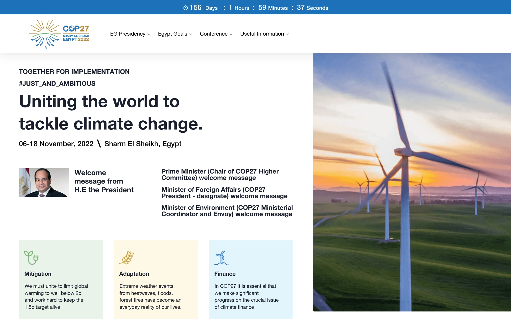
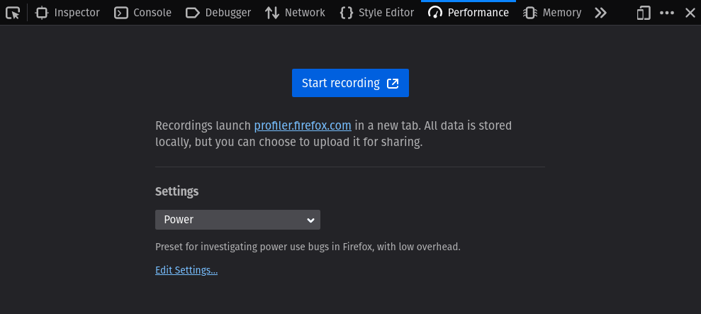
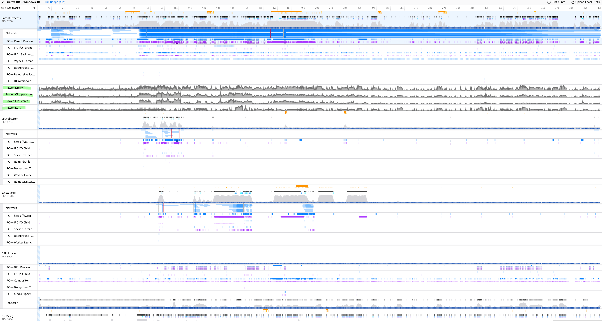

Around this time last year there was a lot of focus on the upcoming COP26 summit in Glasgow. Rightly so, as it marked the five-year anniversary of the Paris Agreement. Under that agreement, countries agreed to revisit and strengthen their commitments towards limiting global temperature rise to 1.5 degrees Celsius at the 26th COP.

With so much attention on COP26, I got curious about how their website stacked up in terms of digital sustainability and performance. So, I took a look under the cover and wrote up **[COP26.org: A quick sustainability check](https://fershad.com/writing/cop26-a-quick-sustainability-check/)**.

The article got a fair bit of attention, definitely more than anything I’d written before. This attention helped catch the eye of some folks over at the UK’s Government Digital Services (GDS) team. With their help, we were able to address one of the factors contributing to the large size of the COP26 homepage.

While COP26 grabbed a lot of headlines, COPs (mercifully short for Conference of the Parties to the United Nations Framework Convention on Climate Change) actually happen annually. This year’s COP event is being hosted by Egypt, and starts on November 7th.

As it approaches, I thought it would be “fun” to take a look at this year’s COP homepage. How does it do in terms of website sustainability?

## What we’ll look at

For this review, we’re going to focus on the desktop version of the COP27 homepage ([https://cop27.eg/](https://cop27.eg/)). We will:

- Touch briefly on the page’s Core Web Vitals & performance story.
- Evaluate its sustainability profile by concentrating on hosting, data transfer, and device energy consumption.

Though that’s only two bullet points, we’ll actually be covering a lot in this post. That includes trying out some experimental diagnostic tooling for the first time.

## Performance - Core Web Vitals

To start with, let’s take a look at the site’s performance through the lens of Core Web Vitals. This is a Google initiative which ties website performance geekery (aka metrics) with tangible user experience outcomes.

Though this post is concerned with the website’s sustainability profile, its performance history helps to set the scene for what we’ll cover later.

### Field data

Google makes Web Vitals data for websites accessible to the public. We'll use that to see how the site is performing in the real world. I personally like to use [Treo’s Site Speed Audit](https://treo.sh/sitespeed) tool for this, since it presents the data in an easy to digest visual format.

Looking at the COP27 website, and [filtering for desktop sessions](https://treo.sh/sitespeed/cop27.eg?formFactor=desktop), we can see that something happened between July and August which absolutely destroyed the website’s paint metrics (First & Largest Contentful Paint).

, First Contentful Paint (FCP), and Largest Contentful Paint (LCP) metrics. TTFB remains steady, but from August FCP & LCP both deteriorate significantly.")

It’s worth bearing in mind that the results we see in Treo are for the entire origin (all pages visited on that website) rather than **just** the homepage. But it’s pretty clear that something changed. Given how it’s impacted the paint metrics, my initial guess was that perhaps a larger main image was swapped in. To find out, let’s use the [Wayback Machine](http://web.archive.org/).

### August, 2022. A redesign

Spoiler in the heading, ey.

Yep, there was a website redesign in August (or late July) which seems to have coincided with the deterioration in paint metrics that we see in Treo. Now I’ll hold off on commenting about the design until later in this post, but below are before and after screenshots.

**Before - July 2nd, 2022**

[http://web.archive.org/web/20220602135905/https://cop27.eg/](http://web.archive.org/web/20220602135905/https://cop27.eg/)

**After - August 2nd, 2022**

[http://web.archive.org/web/20220802092302/https://www.cop27.eg/](http://web.archive.org/web/20220802092302/https://www.cop27.eg/)

Quite a significant change above the fold for the homepage. One interesting thing to note here is the size of the main image. The image of the windmills on July 2nd was a 111 kB PNG file, while the audience photo from August comes in at 2.1 MB (still a PNG).

Another thing to note, from a performance perspective, is that the July image is discovered through an `` tag in the HTML. In August, that’s changed to an inline CSS `background-image` that’s loaded as part of what seems to be a JavaScript powered slider. The image in August is not preloaded either. Harry Roberts [covers these patterns and some](https://csswizardry.com/2022/03/optimising-largest-contentful-paint/#use-the-best-candidate) over on his blog. To grossly simplify it, the `` tag **_should_** always win out.

The two things above are probably enough to have pushed out the LCP, though the degree of change would suggest some other factors are at play too. You're welcome to dig around and see what you can find.

While we were looking at performance, though, we’ve also started to surface some website sustainability issues. Let’s shift focus to that.

## Sustainability

In last year’s audit of the COP26 website, I started looking at sustainability by calculating the homepage’s carbon emissions using Beacon, one of many online website carbon estimation tools. We’re not going to be doing that this year, for [reasons I’ve outlined earlier this month](https://fershad.com/writing/website-carbon-beyond-data-transfer/).

Instead, we’ll look at each individual segment of a website’s sustainability profile. There are three key areas that developers and website owners can control:

- Servers (data centers and hosting)
- Networks (data transferred over the wire to load site content)
- Devices (how the website impacts the devices used to view the site)

### Servers - hosting and CDNs

Let’s start by building a sustainability profile of how the website is hosted.

#### Does it use green hosting?

The first thing we’ll do is check if the website uses a known green web host (or CDN). To find out, we’ll use The Green Web Foundation’s [Green Web Checker](https://www.thegreenwebfoundation.org/green-web-check/). Running the domain (`https://cop27.eg`) through this tool reveals that the site is not hosted on a known green web host or CDN.

#### Where is it being hosted?

It looks as though the site itself is hosted in Egypt, and doesn’t use a Content Delivery Network (CDN) to serve cached versions to global users. To uncover this, I ran the page through WebPageTest from three different locations:

- Virginia, USA ([test results](https://www.webpagetest.org/result/221024_BiDcEW_8Y5/1/details/#waterfall_view_step1))
- Frankfurt, Germany ([test results](https://www.webpagetest.org/result/221024_BiDcEW_8Y5/1/details/#waterfall_view_step1))
- Sydney, Australia ([test results](https://www.webpagetest.org/result/221027_AiDc5R_756/1/details/#waterfall_view_step1))

Looking at the request headers (found at the bottom of each test result’s details page), we can find the IP address of each website request. In each test, the homepage document itself, and resources from the [COP27.eg](http://COP27.eg) domain, come from the same address - `163.121.141.38`.

Knowing this, we can find out where the site is hosted. We’ll another tool from The Green Web Foundation - their [IP to CO2 Intensity API](https://developers.thegreenwebfoundation.org/api/ip-to-co2/overview/). This API does two things:

1. It reveals the country in which the IP address is located, and
2. It surfaces the latest annual average carbon intensity figures of that country’s electricity grid.

Running the IP address above through the API returns:

<!-- markdownlint-disable -->

{
  "country_name": "Egypt",
  "country_code_iso_2": "EG",
  "country_code_iso_3": "EGY",
  "carbon_intensity_type": "avg",
  "carbon_intensity": 466.006,
  "generation_from_fossil": 88.87,
  "year": 2021,
  "checked_ip": "163.121.141.38"
}

<!-- markdownlint-enable -->

So, the IP address is located in Egypt as I mentioned earlier. Last year (2021), Egypt’s grid had an average carbon intensity of 466 grams per kilowatt-hour, with close enough to 89% of electricity generation coming from fossil fuels.

That’s not great. Even though emissions-wise Egypt is pretty close to the global average (442 g/kWh), in terms of generation from fossil fuels it is way above the global average (61.56%). The data here comes from Ember. You can play around with their [Data Explorer](https://ember-climate.org/data/data-explorer/) if you want to go deeper.

#### **Yes, we’ve made some assumptions**

The checks above don’t paint the rosiest picture of the site’s hosting. However, it is worth mentioning that we’re limited here to general, publicly available data. There is every possibility that the team behind the COP27 website has hosted it on a server located in Egypt that is connected to a clean energy source like solar. I really hope this is the case.

### Networks - Page weight & data transfer

Even though network energy use is pretty much a constant ([I go into that here](https://fershad.com/writing/website-carbon-beyond-data-transfer/#data-transfer-network-energy-usage)), it’s still important to be looking for ways reduce the amount of data we send to those visiting our sites.

When a page loads it can help with performance (as we’ve seen above). When a page is **\*\***_loading,_**\*\*** it might help to reduce energy consumption on the user’s device. And, if anything, it can help ensure that the people consuming our sites who may have data caps, or pay-as-you-go plans, don’t chew through their budgets faster than they expect.

#### Page weight is a problem

The homepage initially loads over 19 MB of data. That’s over 9x the [size of the median desktop page](https://httparchive.org/reports/page-weight#bytesTotal) as of September 2022. As I was checking in DevTools, though, I noticed the data being transferred kept ticking up. It eventually stopped at 31.9 MB.

That’s probably another reason why the performance paint metrics are as poor as they are. There’s a heap of data contending for bandwidth as the page loads. Where’s all this data coming from, and what can we do to reduce it?

#### **Images**

There are 155 images requests when the page first loads. They account for 16.8 MB of data transfer. Of these, only **_one_** was a modern image format - a WebP image served by a YouTube video embed near the bottom of the page. Most are PNG or JPEG format, including two images for the event’s mobile app that are 4.5 MB and 2.0 MB.

Reducing the impact of images would be a sensible first step. Applying the `loading="lazy"` attribute to off-screen images should help both sustainability and performance. Using modern formats (with PNG/JPEG fallbacks) would help take things that extra mile, and really get the overall transfer size down.

A lot of the image bloat seems to have come about since the website redesign that we saw earlier. The previous iteration of the site had a clean design that was light on images and fluff. It also demonstrated [some features of Sustainable Web Design](https://sustainablewebdesign.org/category/design/). I’m not sure what was behind the redesign, but my personal opinion is that it was done to the detriment of the website.

#### A self-hosted video file

The homepage also features a self-hosted video file near the bottom of the page. Of the final 31.9 MB downloaded, this one video accounts for 12.9 MB. I’ve included a simplified snippet of the video tag from the site below:

<!-- markdownlint-disable -->

<video preload="auto" controls poster="path/to/post/image.jpg">

<!-- markdownlint-enable -->

The video tag has a `poster` attribute, so there’s going to be something nice shown in place until the user starts watching it. For that reason, the `preload` attribute could be set to `"none"` which would instruct the browser not to download any video content until the user requests it (by playing the video).

#### **A questionable Twitter feed**

Just above the video, there’s a section promoting the event’s app alongside a Twitter feed. On my screen, it looks like this:

Firstly, remember I mentioned a 2.0 MB image promoting the event’s app? This (the phone) is that image. A file which is 1443 × 2802 pixels, rendered at 227 x 440. We’ve talked about images already though. Let’s talk about Twitter.

Files served from Twitter (and related domains) account for 3.4 MB of the total page weight. That’s a fair bit of data to download, only to then display it in a section like the one in the picture above. I’m not a designer, but I’m sure there are better ways this part of the homepage could be presented. Michelle Barker’s covered some ways to reduce the impact of social embeds in [this post for Smashing Magazine](https://www.smashingmagazine.com/2022/02/reducing-web-carbon-footprint-optimizing-social-media-embeds/).

#### Let’s guesstimate the impact

If we could edit the website today to address the three areas highlighted above, what kind of impact might we have on overall page weight? Note that the figures below are guesses made off some knowledge, and assumptions.

- We could **probably** reduce image size by at least 75% (saving 12.6 MB)
- We’d remove the 12 MB downloaded for the video
- We could defer the loading of all Twitter stuff until the user actually requests it (saving 3.4 MB)

So, we could potentially get the page down to a somewhat reasonable 3.9 MB without really having to dive deep into the weeds of website optimisation.

### Devices - Testing energy usage

Still here? Thanks!

We’re now going to do something that I’ve never done before when reviewing a website. We’re going to see how much power it consumes on the client (the browser in this case).

We’ll be using the Firefox DevTools Profiler on a Windows 11 Surface Pro 6 device to record a capture of the site as it loads. We’ll then use a ⚠️ **_currently very much work in progress ⚠️_** fork of the Profiler to look at the power usage. We’ll see data presented in both units of watts, and in units of CO2e (carbon dioxide equivalent).

The CO2e estimates we'll see should be considered experimental at this stage. I’ve been helping to [build out this feature](https://github.com/firefox-devtools/profiler/pull/4243) as part of my work with [The Green Web Foundation](https://www.thegreenwebfoundation.org/). That said, I’ve never used it to review a website, so it’ll be my first time trying to analyse these figures too. Let’s learn together, friends.

#### Recording the capture

Rather than diving straight into the profile, let’s race through recording the capture first. I believe that the ability to record a power profile from devices was introduced in Firefox 104, so you’ll need to be on that version of the browser or newer. The option will show up on all platforms, but actually only works on Windows 11 & Mac OS at the time of writing.

In the browser, open up DevTools and navigate to the Performance tab. There, you’ll see a dropdown with different presets which you can use. There’ll be a Power option in that list. With that selected, you can start recording!

#### A wild profile appeared

Once you’re done recording, the Profiler will automatically load your recording in a new tab. It’ll probably be overwhelming, just like the screenshot below. What we’re going to do in this post mostly focuses on the four Power rows (which you _might_ be able to see highlighted in the screenshot below).

Before continuing, I’d like to again reiterate that I’m using a local, forked version of the Profiler to uncover carbon emission data. While energy consumption data is currently available in the live version of the tool, the carbon emissions data you’ll see shortly is from a branch that is still being actively worked on.

#### Device level energy and carbon estimates

Let’s zoom in on the four Power rows. Here’s what they show us.

 in the Firefox Profiler.")

In the screenshot above, I’ve hovered over a point in time on the **Power: CPU package** row. This brings up a tooltip showing:

- Power (in watts) - The power consumption by the CPU package at that point in time on the timeline.
- Energy used in the visible range (in milliwatt-hour) - the energy used by the CPU package over the entire profile.
    - Next to the milliwatt-hour figure there’s also a carbon estimate shown in milligrams of CO2e. This is the bit that I’ve been working on with The Green Web Foundation.

Okay, so there’s a likelihood that you’re like me and don’t know your milliwatts from your milligrams. All we really need to know is that we’re dealing with some pretty small figures here.

#### What does this mean?

Here’s how I’m reading it:

> For each time someone on a Surface Pro 6 loads the COP27 homepage, 45 milliwatts of energy are used by the device, equating to an estimated 20 milligrams of CO2e.

It might help to work with larger numbers here. If 100,000 people visited the homepage on a Surface Pro 6, then a collective 2000 grams (2 kilograms) of CO2e will be generated by the devices.

#### A few things to note

While this is super handy data to have, there are a few things to keep in mind - especially with the experimental CO2e figures I’ve shown.

- The profile I’m reviewing is loading the page with an empty cache. Would caching change power consumption? That’s something to look into in another post.
- The CO2e figures are generated using **_global average grid intensity_** figures for 2021, which are [imported into the project from CO2.js](https://developers.thegreenwebfoundation.org/co2js/data/). Ideally, we’d like to use more region-specific figures for even greater detail. There’s been [some conversation](https://github.com/firefox-devtools/profiler/pull/4243#issuecomment-1266624528) [around this](https://github.com/firefox-devtools/profiler/pull/4243#issuecomment-1270018399) as part of the PR for this feature.
- I honestly have no idea whether looking at CPU package, CPU cores, iGPU, or DRAM would be the right approach here. There are some details documented in the [Firefox Source Docs](https://firefox-source-docs.mozilla.org/performance/power_profiling_overview.html), but I’ve yet to go into detail on that.
- This just captures the page load. The only interactions I had with the page were to close the cookie banner & app promotion overlay.

I’d love to explore these further when I’ve got a bit more time. Especially measuring interactions.

## Overall sustainability profile

We’ve unpacked a lot in this post, so thank you for making it this far.

To finish, let’s get back to answering the question we began with - how does the COP27 homepage stack up from a website sustainability perspective?

On the whole, there’s a lot that could be done better. Let’s break it down by looping back on the server, network, and device information we’ve found.

### Servers

Summary: Based off what we can uncover, not great.

- It looks like all content for the domain is served from Egypt, without the use of a CDN.
- Egypt’s energy intensity is a bit above the global average, with most of that generation coming from fossil fuels.
- We can only hope that the site has been hosted on servers that get all/most of their power directly from clean energy sources.

### Networks

Summary: Poor, but can be easily improved with a few quick fixes.

- The page loads almost 32 MB of data when first visited.
- Most comes from images. Using lazy loading & modern formats could reduce their size significantly.
- Next culprit is a video near the bottom of the page. Changing to `preload="none"` here would save 12 MB of data download.
- Finally, a design rethink of the Twitter feed on the site could help shave off more bytes.

### Devices

Summary: “Yeah nah”. Or maybe “nah yeah”.

I’m not really sure to be honest. Since we’ve used some experimental tooling to surface device level CO2e estimates, I don’t really have a reliable baseline to go off.

Let’s end on a positive, and give them a passing grade here 🙂.

​

​
