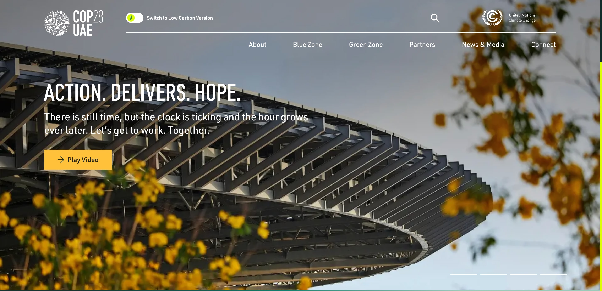
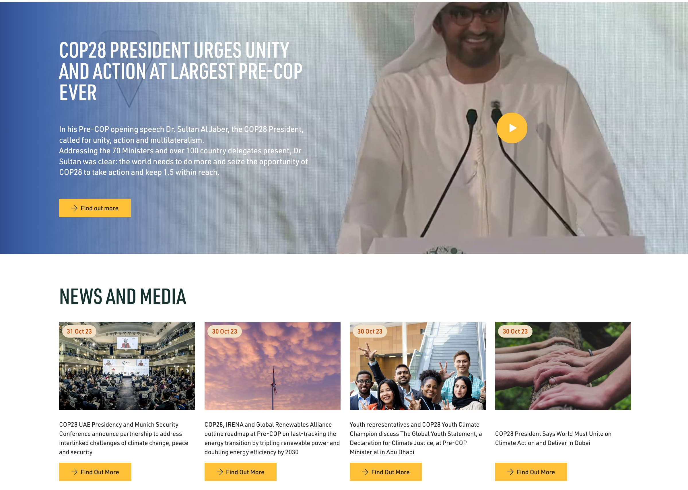
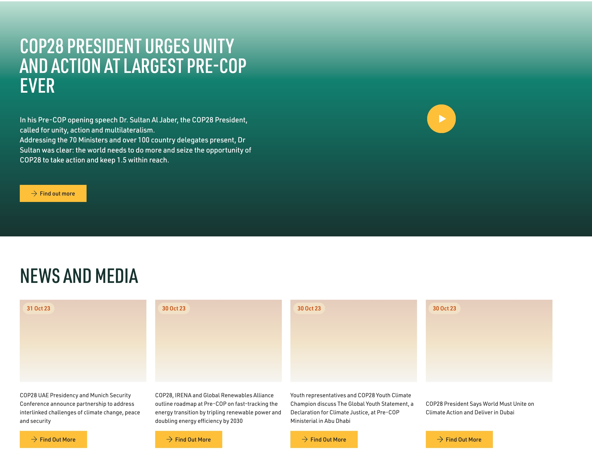

COP28 is rolling around soon. It’s around about a month away at the time of writing. So … yep, that means it’s time to take a look at the COP28 website and see how it stacks up in terms of web sustainability. If you’re interested in what my past reviews of COP websites have uncovered, you can read my takes on the [COP26 (Glasgow)](https://fershad.com/writing/cop26-a-quick-sustainability-check/) and [COP27 (Sharm El-Sheik)](https://fershad.com/writing/cop27-egypt-a-webpage-sustainability-review/) websites.

## What we’ll look at

This blog post is very much a sequel to Michelle Barker’s excellent [_Greenwashing and the COP28 Website_](https://css-irl.info/greenwashing-and-the-cop28-website/) post. I’ll refer to it a few times through this review, and I strongly urge you to give it a read.

This review will differ from my previous COP website reviews. It won’t focus on how the website performs, what its Core Web Vitals are, or try to estimate the carbon emissions of the site. I won’t even be checking the site against the recently published [Web Sustainability Guidelines (WSG) 1.0](https://w3c.github.io/sustyweb/) (cool idea though, any takers?).

This review will focus nearly entirely on the implementation of just one … uh … feature - the “Switch to Low Carbon Version” toggle that is found in the site header.

The website I’ll be looking at is [https://www.cop28.com/en/](https://www.cop28.com/en/), and my analysis was performed between October 27 and October 31, 2023.


Now that we're about a week in to COP28, I thought I'd go back and take a quick look at the website to see if anything had changed. I've captured them in callout boxes just like this throughout the post, so anyone who's already read this article can just skip through 🙂.

With previous COP website reviews, I've noticed that once the event starts content on the website balloons. With the a "low carbon design" having been present on the site since its inception, I was curious to see how new content was being treated in this design.

For the quick tl;dr version, it seems like new content has just be slapped onto the site with not thought given to the low carbon version.


## Credit where it’s due

Firstly, hey, credit to the team behind the COP28 website for actually giving _some_ thought to making a sustainable website. Unlike the past two COP websites I’ve checked, this one does show as being “green hosted” when checked on the [Green Web Foundation’s Green Web Check tool](https://www.thegreenwebfoundation.org/green-web-check/?url=https://www.cop28.com/en/).

The fact that there’s a “low carbon version” of the site might also be seen as a good start. I was honestly surprised when I first checked this site a couple of months ago and saw the toggle there. But, after looking into it a bit more at that time I was let down by how little the toggle actually did. Michelle has done a great job of capturing those sentiments in her post (did you read it yet?).

### Website updates

Since Michelle’s post went live, there have been some updates made to the way the low carbon toggle functions on the COP28 site. When Michelle examined the page, the toggle simply hid images visually, though they were still being downloaded. A recent change (as highlighted in this [ABC News article](https://www.abc.net.au/news/2023-10-31/un-cop28-climate-summit-accused-greenwashing-website-low-carbon/103020978)) now results in the page reloading when the toggle is triggered. This means that images are no longer downloaded in the background on the “Low Carbon Version” of the site.

As we’ll see through the post, despite the changes mentioned above which address \***\*some\*\*** of the shortcomings highlighted in Michelle’s post, the COP28 website still leaves a lot to be desired when it comes to showcasing low carbon web design and development.

## The Full Experience

When a visitor first lands on the COP28 website, they are presented with what the website calls the “Full Experience”. This is apparently the feature-rich version of the site, with the primary feature seeming to be the presence of images on the page (this bit of sarcasm will make sense soon). Most of the homepage is text, images, and a slider-carousel thing at the top. A couple of videos are available to view, but don’t load anything without user interaction. A nice touch.

Other pages on the site are mostly text and images.

In order for this “Full Experience” of text and pictures to happen, the user is made to download the site’s main JavaScript bundle. When I checked, the bundle was 527 kB in size. That’s half a megabyte just to read some text and see some photos. A lot of the rest of this post focuses on the main JS bundle.


Checking the website again, the size of the JS bundle has now jumped up to 612kB. There's also some additional JavaScript that's been added for an accessibility overlay that the site uses.

However, the total transfer size of the homepage is now an eye watering 35.6 megabytes. Yep, megabytes on page load ... without scrolling. Why? YouTube.

Two new carousel sections have been added to the homepage, each containing multiple embedded YouTube videos. While these carousel's _do not_ automatically scroll through, they content for each YouTube embed they contain seems to be downloaded when the page first loads.


## Switching to the Low Carbon Version

Someone coming to the website for the first time might see the toggle at the top saying “Switch to Low Carbon Version”. Curiosity could get the better of them while the page is loading, and so they click on the toggle. If they’re lucky, it responds to the click. If they’re on a slower network connection or a low-spec device, though, it probably won’t.

That’s what happened to me the first time I visited the site. As the page was loading, I saw the toggle at the top and you bet I clicked it. I took this action before the images in the carousel slider were loaded. But nothing happened. So I clicked it again. Nothing still. Finally on the third time of trying, it worked! But why did it take so long?

It turns out, that all the logic for the toggle and its subsequent behaviour (setting/unsetting the `low-carbon-mode` key in local storage) is baked into that 500+kB main JavaScript file. So, for the “low carbon toggle” to be useful at all any visitor must wait for their browser to download, parse, and execute that JS file. And if you’ve got JavaScript disabled (or the download fails), then you better get your COP28 information from somewhere else!

## An underwhelming experience

Now, we’re finally on the “Low Carbon Version” of the website. Getting there requires the page to reload, but thankfully caching avoids us having to re-download the main JavaScript file. That [doesn’t mean the parsing and execution get skipped](https://webperf.tips/tip/cached-js-misconceptions/) though.

Anyway, boy oh boy is the low carbon site a let down. It feels as though little-to-no creative thought has gone into designing a low-carbon web experience here. I feel like an arse for saying that, especially given my lack of digital design chops, but that is genuinely how I feel when looking at the low carbon version of this website. This was a chance to showcase creative, engaging [Sustainable Web Design](https://sustainablewebdesign.org/). Instead the low carbon site might be best described as bland, lifeless, and dull.

The colour images that are _a key feature_ of the “Full Experience”, are replaced with boxes of coloured gradients. The page is pretty much just blocks of text floating in space. **It gives the impression that something is broken with “Low Carbon Version” of the site.** A metaphor, perhaps, for the COP process? I digress.


The "Full Experience" of the homepage now loads well over 30MB of content for YouTube embeds. How about on the "Low Carbon Version"?

It loads the same.

The "Low Carbon Version" of the homepage now downloads 34MB of content. Again, we've got the same 612kB main JS bundle and some code for the accessibility overlay. But again, the overwhelming majority is a result of the YouTube embeds that are present on the "Full Experience" version of the site.

What's really disappointing here is that is looks as though the content has just been slapped onto the "Low Carbon Version" without any thought or consideration given to actually improving performance (let alone considering sustainable web design principles).

On face value, it looks as though there was no thought given to _how_ the "Low Carbon Version" of the site would be managed once the event started and new content needed to be added. This adds more fuel to the feeling that this is just greenwashing, that the "Low Carbon Version" was just made to appease folks without actually spending time to plan and execute it properly.


### It doesn’t have to be this way

Low carbon web design is a burgeoning part of the digital design community. And the challenge to build eye-catching, and interesting low carbon websites hasn’t got in the way of many web designers and developers. Just take a look at some of the stunning low carbon designs featured on [lowww.directory](http://lowww.directory) and [lowwwcarbon](https://lowwwcarbon.com/).

## Nothing else really changes

So, the low carbon version of the website strips out most of the colour images. But (spoiler in the heading) nothing else on the page seems to change all that much.

We’re still using the same main JS and CSS bundles (~527 kB and ~30kB respectively). We’re still loading in all the font files (~380 kB). If I click the YouTube video on the homepage, it still loads the whole YouTube embed experience which is another bunch (~1 MB) of JavaScript to download. So really the toggle’s wording could change from “Switch to Low Carbon Version” to simply “Remove Images”.

### What difference does it make?

Removing images on the homepage sees about a 1.2 MB reduction in the size of the page (including lazy-loaded images). On other sub-pages, using [_What is the Green Zone?_](https://www.cop28.com/en/green-zone) as an example, the reduction is closer to 400 kB. Remember, to achieve this 400 kB saving we’re downloading 520 odd kilobytes of JavaScript. That feels out of whack.

### Let’s talk about caching

In reality, we’re not _downloading_ the main JS file each time we navigate to a new page on the site. The file does come with a `cache-control: public, max-age=31536000` header, and gets stored in browser cache after it’s first downloaded. As we navigate the “Low Carbon Version” of the site we’re not redownloading it, but our devices still have to deal with the computation required to make that JavaScript useable. This happens on each page navigation.

Where caching won’t help, though, is when the website is changed. The main JS file comes with a hash in the filename. At the time I checked the site it was called `main.4f6b1b16.js`. Since this looks like a React site, it is very likely that the hash value would change if a change is made to the website code. In this way it “busts” the cache for that file, meaning it gets downloaded again by any returning visitor.

**And that sucks if you’re a returning visitor who last left the site with `low-carbon-mode` turned on.** Returning to the site would mean you’re again downloading the entire JS bundle, just to get that sweet, sweet low carbon experience of text floating in a digital void.


Returning to the homepage as someone with `low-carbon-mode` turned on now sucks even more, because all the YouTube content you probably aren't going to watch just gets downloaded anyway.


## How could it be better?

Time for a change of mindset. So far, I’ve raised concerns about:

- The “Switch to Low Carbon Version” toggle and how it is implemented.
- The main JS bundle that comes with the site.
- The design of the low carbon version.

For the rest of this post, I’ll be touching on a few ways these could be bettered to deliver a more meaningful low carbon website experience. I’ll go in reverse order of the list above.


The bloat on the homepage caused by the multiple YouTube embeds that are downloaded is easily solved. There are solutions out there that play well with React-based websites such as [justinribeiro/lite-youtube](https://github.com/justinribeiro/lite-youtube) or [paulirish/lite-youtube-embed](https://github.com/paulirish/lite-youtube-embed). There's even this [sick little trick](https://css-tricks.com/lazy-load-embedded-youtube-videos/) comes courtesy of Arthur Corenzan to consider. Heck, it can [even be done in an edge worker](https://fershad.com/writing/youtube-facades-with-cloudflare-workers/).

Of course, giving some thought and planning into how the "Low Carbon Version" of the website will actually be maintained and updated with new content is also a very important (first) step.


### Give some thought to low carbon design

I’ve already touch on this earlier, but there’s a bit more to say. A low carbon website doesn’t have to be a wall of text. Just check out the two gallery sites I’ve linked to above. Low carbon website designs can be equally as impactful as the so called “full experience”.

One of the things noted in Michelle’s post is that the site downloads multiple TTF font files. These could be replaced with WOFF2 versions for starters, which would reduce the file size. But why not go a step further and see how creative the design team could get with a single variable font, or even [just using System Fonts](https://systemfontstack.com/).

### Ditch (most of) the JavaScript

There is absolutely nothing obvious on this website that screams out as needing over 500 kB of client-side JavaScript to function. Sure, there are elements (like our good friend the low carbon toggle) that require a _sprinkling_ of JavaScript to be useable. But, the site overall could very easily be built using low- or no-JS builders like [Astro](https://astro.build/) or [Eleventy](https://www.11ty.dev/), rather than React.

This, in turn, would lead to some interesting opportunities to improve the low carbon toggle as well.

### Move low carbon detection off the device

If we want to remove most of the client-side JS, how would low carbon mode detection still work? A combination of cookies, and edge compute would make it possible to still have a working toggle for a fraction of the client-side JavaScript.

This is made possible because when a user toggles low carbon mode, the page reloads from the server. As a result, it’s possible to intercept those requests and deliver a low carbon page directly to browser. Here’s how it might work:

- The client-side code for the toggle sets as cookie to indicate the user wants low carbon mode. This could probably be done in less than a dozen lines of JS.
- When the toggle is changed, the page reloads.
- During this process, the response to the browser is intercepted by an edge worker (think Cloudflare Workers, Vercel Edge Function etc.)
- The edge worker looks for the cookie and based on its content returns the HTML for a “low carbon” or “full experience” page to the browser.

**But how’s this any better for sustainability?**

Surely running all this stuff at the edge for tens of thousands of requests produces more CO2? Fair point. Here’s why _I_ _think_ this approach is more sustainable.

- We have no control over user devices. By removing the JS needed to check and deliver the low carbon site from the user’s device we’re benefiting _all users_. Those on better devices get an even faster experience, and those on low-spec devices don’t get bogged down as the page tries to load.
- Edge workers are hyper-optimised for this kind of task. Running our compute there would take a fraction of the time (and therefore energy) compared to running it on the client.
- We can improve this further by choosing edge providers who are taking steps to try and ensure as much of their network is powered by green energy or are mitigating the emissions of their operations. We’ve got much more control over this decision than we do over what energy is powering the devices our users have.

It’s worth noting that _this is just my (slightly informed) opinion_. Especially the second point isn’t based on any hard data I’ve seen. If you do have data or research around this, [I’d love to hear about it](https://fershad.com/contact/)!

### Low carbon by default? Nah, not yet

In Michelle’s post, she mentions that the low carbon version of the site should be the default experience. I share this opinion in principle. But. The low carbon experience of the COP28 website as it is today **_is not suitable_** to be the default version of the website. It would give a lot of users a very wrong impression of what low carbon web design is all about. For mine, that would be more detrimental than helpful.

Hopefully, though, between now and the start of COP28 we see further changes to the site and a more thoughtful, well designed “Low Carbon Version”.
