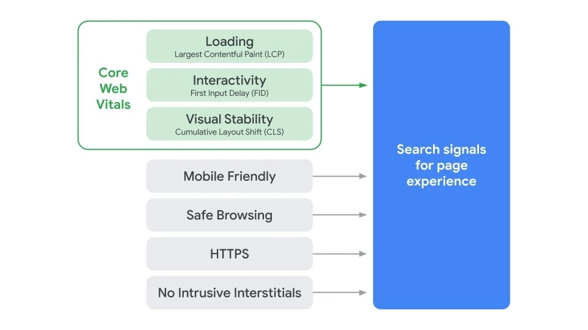


Core Web Vitals have evolved significantly since I wrote this post. You should try to reference more recent content. [Google's developer docs](https://developers.google.com/search/docs/appearance/core-web-vitals) is a good place to start.


A couple of weeks ago Google put out a [short blog post](https://developers.google.com/search/blog/2020/11/timing-for-page-experience) to announce something rather significant. Core Web Vitals metrics will be added to the page experience signals mix as part of the May 2021 search update.


Google has delayed the implementation of Core Web Vitals in its search rankings. The new timeframe for its inclusion is mid-June to August.

Read Google's [update announcement here](https://developers.google.com/search/blog/2021/04/more-details-page-experience).


Page experience signals include things like whether a page is mobile-friendly, served over HTTPS, and isn't spamming the user with intrusive popups.

So that means, if you've got an SEO plan in place then you really should start looking at the overall experience of your website. Catering for Core Web Vitals should be as important as identifying the right keywords to add into your content.

## So, what are Core Web Vitals?

Put simply they're a set of metrics that aim to quantify real-world user experiences across the web. They measure page interactivity, content loading, and content stability during page load. The three metrics that form Core Web Vitals are:

- **Largest Contentful Paint (LCP)**: A timing of how long it takes for the largest above-the-fold element to be painted on screen. This is usually a hero image/video or large text block.
- **First Input Delay (FID):** Measures the time it takes before the browser can react to a user input (like a click or tap).
- **Cumulative Layout Shift (CLS):** Indicates the movement of visible elements as the user loads and interacts with the page. You know when you start reading an article, then an ad loads above it & all the content get pushed down? CLS measures that.

To look at it a different way, these three metrics allow Google to better understand a page's:

- Perceived load time (LCP)
- Responsiveness (FID)
- Page experience (CLS)

## Beyond search rankings

Google's announcement goes beyond just possibly impacting the search ranking of pages. They've also been testing visual indicators showing page experience [within the Chrome browser](https://blog.chromium.org/2020/08/highlighting-great-user-experiences-on.html). Now they plan to starting [testing the same indicators](https://developers.google.com/search/blog/2020/11/timing-for-page-experience#a-new-way-of-highlighting-great-experiences-in-google-search) directly on search results pages. If they deem the tests to be successful, then expect to see these visual indicators rolling out in May 2021 as well.

That's a pretty big deal. It allows users to actively choose to visit a page with better overall experience.

## Checking your site for Core Web Vitals

I'd recommend using [PageSpeed Insights](https://developers.google.com/speed/pagespeed/insights/) or [WebPageTest](https://webpagetest.org/) to check web pages on your site for the Core Web Vitals listed above. If your site as a whole receives a high number of visitors per month then you can also find real user Core Web Vitals measurements through Google's Search Console dashboard.

That will give you a baseline to start working from. While you're at it, you might also want to have a peak at your competitor's websites to see how they're performing.

## Fixing Core Web Vital Issues

Each site is different, but there are a few common issues that pop up time and time again for Core Web Vitals. Simon Hearne covers them in great detail [over on his blog](https://simonhearne.com/2020/core-web-vitals/). I've included links below that will take you directly to the relevant section for each of the Core Web Vitals.

- [Largest Contentful Paint](https://simonhearne.com/2020/core-web-vitals/#largest-contentful-paint-lcp)
- [First Input Delay](https://simonhearne.com/2020/core-web-vitals/#first-input-delay-fid)
- [Cumulative Layout Shift](https://simonhearne.com/2020/core-web-vitals/#cumulative-layout-shift-cls)

These things can take some time to fix depending on the size and complexity of your site. Of course you also want to be ensuring that any changes you make don't hurt other parts of your site's performance, or impact user experience.

Google's given us all a six month heads up. There's time, but especially with the holiday period just around the corner May 2021 will be upon us before we know it.
