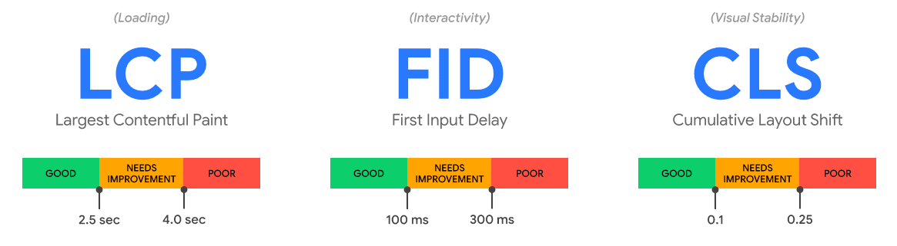


This article was [originally published on the EcoPing blog](https://ecoping.earth/blog/core-web-vitals-and-sustainability).


There's been a lot of talk about Core Web Vitals recently. Rightly so too. Early data is showing that [Core Web Vitals does seem to be playing a factor in Google Search rankings](https://www.sistrix.com/blog/core-web-vitals-is-a-measurable-ranking-factor). With all the talk has come a fair bit of action too. Website owners are looking for ways to improve their base Core Web Vitals scores in a bit to capture some vital SEO juice.

But, besides the SEO upside (and the commercial benefits too - see [https://wpostats.com/](https://wpostats.com/) to learn what I mean), there are also digital sustainability benefits to having better Core Web Vitals. Read on to learn where Core Web Vitals and web sustainability intersect, and what you can start doing on your website.

## A Core Web Vitals refresher

If you're reading the term Core Web Vitals for the first time or need a quick reminder of what they are this section is for you.

Put simply, Core Web Vitals are a set of metrics that aim to quantify real-world user experiences across the web. They measure page interactivity, content loading, and content stability during page load. The three metrics that form Core Web Vitals are:

- **Largest Contentful Paint (LCP)**: A timing of how long it takes for the largest above-the-fold element to be painted on screen. This is usually a hero image/video or large text block.
- **First Input Delay (FID):** Measures the time it takes before the browser can react to a user input (like a click or tap).
- **Cumulative Layout Shift (CLS):** Indicates the movement of visible elements as the user loads and navigates a page. You know when you start reading an article, then an ad loads above it & all the content gets pushed down? CLS measures things like that.

Each Core Web Vital metric has thresholds upon which a user's experience can be measured. The [below graphic from Google](https://web.dev/vitals/) illustrates this. In short, LCP should be under 2.5 seconds, FID less than 100ms, and CLS less than 0.1 for the entire life of the pageview. To be considered as passing Core Web Vitals, a web page (or website) should meet the "Good" target for all three metrics at the 75th percentile.

## Better Core Web Vitals, better for the planet

So just what are the intersections of these Core Web Vitals metrics and web sustainability? Let's go through some of the ways to ensure your site meets the thresholds above and examine how they can help your site's digital sustainability too.

### Improving LCP

We all want our websites to be fast. So how do we go about ensuring our site's LCP is less than 2.5 seconds? It's all about ensuring the content which is visible when the page first loads (also known as "above-the-fold") gets rendered on the screen as soon as possible.

Using a Content Delivery Network (CDN) is one way you can help content reach your website's visitors faster. CDNs keep copies of static content (like images, videos etc.) in worldwide data centers. Say your site is hosted in Iceland, and someone from Melbourne, Australia visits it. With a CDN in place, the visitor would receive a copy of your file from a nearby data center (probably in Australia or Singapore), rather than having to wait for data to travel all the way from Iceland.

Besides a CDN, there are a few things you can do on your website itself to improve LCP and make it more sustainable at the same time.

#### Think twice about hero images/videos

Hero images or videos are the large (often full height and width) elements found at the top of many web page designs. They're eye-catching, but they can also be very large in terms of file size. This is both bad for a page's LCP and its sustainability.

What can you do:

- Look to avoid using large hero image/video elements on your site. Make this a factor when you assess designs and templates.


💚 This is the most sustainable approach.


- If you do still use hero elements, consider the following:
    - Optimise the image to within an inch of its life.
    - Avoid auto-playing any hero video content. Be creative with how you design around hero video elements - could it start playing only after the user has interacted with the page? ([Justdiggit](https://justdiggit.org/) have a great example on their homepage).


💙 These are the next best options for a sustainable website.


- Text renders faster than anything else on the web. So, if you've got only text content above-the-fold then you're off to a good start to have better LCP scores (there are plenty of ways to muck this up though).
- Use the `loading="lazy"` attribute on any images that are not visible when the page first loads. This will defer their download, freeing up bandwidth for more important resources.

#### You can optimise fonts

Believe it or not, you can actually optimise the fonts used on your website too! Most content on the web is text, and there's a strong chance a visitor to your site has come there looking for some information. The sooner you can render this information on the user's screen, the happier they will be.

What can you do:

- The most impactful thing you can do is to not use web fonts at all on your site, and instead rely on the fonts that come built into every OS (system fonts).
- If you are using web fonts:
    - Use modern font formats like WOFF2 or WOFF. They are a fraction of the size of other formats.
    - If your font license allows, you can also try removing unused characters from your font files. This is known as subsetting.


💚 Either, ideally both, of these options will help greatly reduce the weight of font files on your site.


#### Remove any render blocking CSS and JavaScript

Web browsers try to parse and render web pages as quickly as possible. However, if during this process the browser encounters CSS or JavaScript (JS) then it will stop rendering the page until after it has finished working on the CSS/JS. If this occurs, we say that the responsible CSS or JS code is "render blocking". Render blocking code is _the worst_ for LCP.

What can you do:

- Regularly audit the JavaScript code on your site - especially third-party code (like analytics, tag managers etc.). Routinely remove scripts you find which are no longer needed.
- Try to reduce the CSS you use on your page.
    - If your site has a build step, can you create unique CSS files for each page which contains only the classes and selectors used for a given page?
    - Break CSS up into separate files for different sections of a page. For example, you might separate the CSS for your header section, footer, blog posts, and image gallery into four separate files. This will allow you to load those files only when they are needed (if a page doesn't have an image gallery, it doesn't need that CSS). It will also allow you to benefit from caching for files that are used across multiple pages on your site.


💡 There are other techniques you can use as well, like [asynchronously loading CSS](https://www.filamentgroup.com/lab/async-css.html) and [using defer/async attributes appropriately](https://flaviocopes.com/javascript-async-defer/) for JavaScript files. However, the strategies above will reduce the amount of CSS/JS you end up shipping to the user. 💚 This is better for the planet.


### Improving CLS

Layout Shifts are annoying. We've all visited a website where content jumps around as we're trying to read it. Or a site with a slow loading ad at the top of the page which pushes everything down when it finally loads seconds after the rest of the page's content.

The Cumulative Layout Shift (CLS) metric provides [a measure of a web page's visual stability](https://web.dev/cls/). The lower the CLS score for a page, the less content is jumping around while the user navigates the page.

There's not a lot of overlap between CLS optimisations and website sustainability, but here a couple of impactful things to keep in mind:

#### Reduce the impact of font loading

The `font-display: swap` CSS property lets developers instruct the browser to show a fallback font while a web font is downloaded. The browser then swaps in the web font once it is ready. This "swap" can result in some shift in content on the page as the new font's style takes effect.

The most sustainable way to reduce this CLS impact is by using system fonts for your site's content.


💚 As above, this is the most sustainable approach you can take with fonts.


#### Reserve space for lazy-loaded images

Lazy-loading images is super easy in modern browsers. Just by adding the `loading="lazy"` attribute to an image tag it is possible to defer the loading of that image until just before it enters the viewport. This is great for sustainability, as it means we're not downloading content the user might never see.

However, this can cause content to get pushed around as the lazy-loaded image gets downloaded and painted on the screen. Thankfully, accounting for this is really easy too. Along with the `loading="lazy"` attribute, setting the `height` and `width` attributes for each image allows the browser to keep space for it when it first renders a page.


Notes

1. If you're not sure what height or width to set on an image, just go with dimension of the original image file you uploaded.
2. The `aspect-ratio` CSS property can be used for the same purpose, but it's more efficient to use HTML attributes.

💚 Remember to also compress, optimise, and resize your images so that you're serving more sustainable versions to website visitors.


### Improving FID

First Input Delay (FID) is a metric that [measures the responsiveness of a web page](https://web.dev/fid/) when a user initially interacts with it. Without getting into the weeds too much, FID measures any delay the browser experiences upon a user's first interaction on the page (click, tap, key press etc.). A poor FID measurement indicates that a page is either unresponsive or could feel laggy to a user.

Browsers have a "main thread" on which all processing and execution is performed. This main thread also handles user interactions, rendering, and layout. JavaScript is also processed on the main thread. If the main thread is busy, user interactions cannot be processed until the main thread is free. This is more pronounced on mobile devices which have less processing power than laptop/desktop computers.

JavaScript is one of the most process intensive things browsers have to deal with. Too much of it often blocks the main thread and as a result can cause poor FID timings. Using the `defer` attribute on non-critical scripts can go some way to improving things, but when looking at FID from a sustainability perspective there are three main things you can do:

**1\. Reduce the amount of JavaScript you ship**

Sounds obvious right? If too much JavaScript is a cause of FID issues, then reducing the amount of JS your page loads will help improve things. This is easier said than done though, especially in modern web development. Here are some things to consider:

- If your site's content is mostly static (infrequent changes, same for all visitors) then consider using a Static Site Generator, or a framework that allows you to output static pages as plain HTML.
- For sites that are more dynamic, look into using smaller JS frameworks (like Preact instead of React), or one that ships compiled code (like Svelte).
- Periodically review your own code. Are you using a JavaScript library, plugin or polyfill that is no longer required? Could you replace a library with a native (vanilla) JavaScript implementation instead? Could you use CSS to solve a problem you're currently using JavaScript for?

**2\. Remove/reduce third-party JavaScript**

This ties in with the point above, but I've separated it to give a bit more emphasis. Regularly review any external scripts that are loaded by your site. Do you still use or get value from using the services you are loading scripts for? If not, then remove the script entirely.

**3\. Break JavaScript into smaller files**

With the JavaScript that remains on your page, try to split functions into smaller, asynchronous tasks. Not only does this help shorten tasks that run on the main thread, but it can have the added benefit of giving you more control over what JavaScript you load on individual pages.


💚 There's an added sustainability benefit to using less JavaScript on your website, and it's one that's felt by your users. Processing JavaScript can be a heavy task, especially on mobile devices resulting in faster battery drain. Having less JavaScript on your website can help extend the battery life of a user's device, meaning they have to charge it less frequently.


## Wrapping up

The tips above can help you deliver better performance and a smoother user experience on your website. They'll also help you get started down the path of having a more sustainable website frontend. Combine with hosting your website on [a green web host](https://www.thegreenwebfoundation.org/) and using a CDN to serve static assets to really start reducing your site's overall impact.
