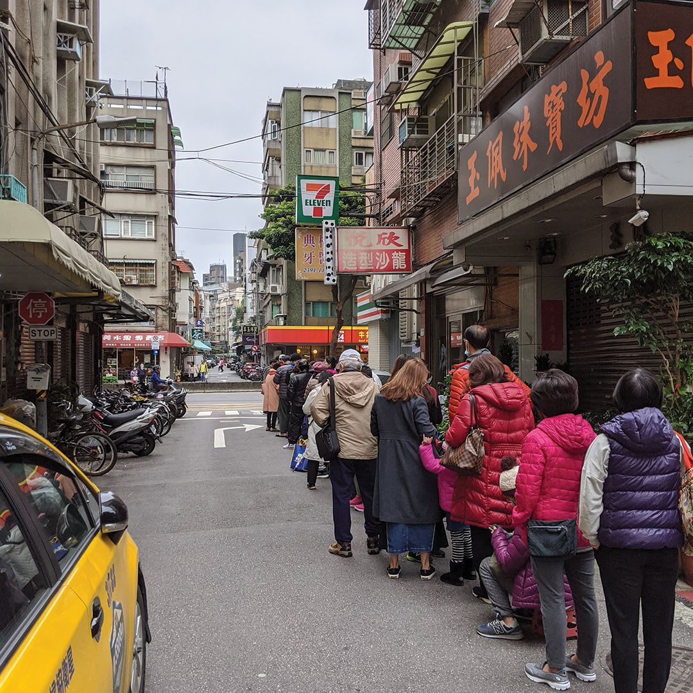

Life's different now. You don't need me to tell you that, especially if you're one of the 3 billion-plus people currently living under some form of lockdown. But even if you're not, life in the first half of 2020 has taken on a distinctly different look and feel.

COVID-19, coronavirus, SARS-CoV-2, or whatever other unsavoury names you want to give it, has flipped the global economy on its head. It's exposed the best and worst of society. And it's forced a large swath of the workforce out of work, or to work from home through no choice of their own. For some, the change to a 'home office' setup has been welcome. For others, [it's been tough](https://www.abc.net.au/news/2020-04-01/tiny-apartment-life-during-the-coronavirus-lockdown/12084538) to find the right balance, space, and drive to get things done.

## The situation in Taiwan

Living in Taiwan we've been largely spared the widespread loss of life and disruption that other countries have witnessed. The government has been [on the front foot](https://www.smh.com.au/world/asia/while-other-countries-lost-precious-time-taiwan-mobilised-to-keep-covid-19-at-bay-20200316-p54ah8.html) against the virus since late December 2019. That's long before the WHO declared this a pandemic.

At that time officials were boarding flights arriving from China to check on the well-being of passengers. Shortly after, the central government introduced a rationing system for surgical masks aimed at preventing hoarding. At hospitals, office buildings, shopping centres and restaurants all visitors had their temperature taken at the entrance. Some even required visitors to wear surgical masks while inside.

From early on Taiwan started tracking those entering the country. It merged health and immigration databases [within a day](https://jamanetwork.com/journals/jama/fullarticle/2762689), allowing physicians to see if a new patient had recently entered the country. As the pandemic drew on, all foreign arrivals in Taiwan were quarantined and tracked for 14 days. It's a system that has [drawn](https://time.com/5805629/coronavirus-taiwan/) [widespread](https://www.atlanticcouncil.org/blogs/new-atlanticist/lessons-from-taiwans-experience-with-covid-19/) [praise](https://www.bloomberg.com/opinion/articles/2020-04-05/taiwan-s-advance-on-who-in-covid-19-shows-its-place-in-world).

Thanks to a combination of the above measures, and no doubt a healthy slice of luck, Taiwan has managed to remain relatively unscathed thus far. Life here goes on as close to normal as possible. That said, it is evident that fewer people than usual are eating outside, or going to shopping malls. It feels like there are fewer people on the metro and buses here in Taipei, especially outside of peak hours (yep, people still commute to work). Business owners I know are feeling a pinch, and that's with no 'stay at home laws' currently enforced.

## Has this changed the way I work?

### In 2019

I've been working for myself for about 9 months now. Pre-COVID-19 I would spend my working days either at the local library or any number of cafes around Taipei city. Sometimes I'd get there on foot, other times by bike, and for places further afoot I'd hop on the bus or metro.

Work itself was steady. I started working for myself in August 2019 and picked up a client shortly after that. That kept me busy while I found my feet.

### In 2020

Not much changed for me in the first half of January 2020. I was still going out to cafes to work. I was still happy to take public transport to get to where I needed to go.

I started getting more cautious around the end of January. Either side of the Chinese New Year holiday my girlfriend came down with allergic reactions. As a result, we paid multiple visits to our local hospital. There we saw an increased level of caution from the moment you approached the door. At that time even the security officers manning the hospital entrances were decked out in head-to-toe protective gear. This gave me the first real indication that maybe this new virus was something to take a bit more seriously.

Since then my working habits have somewhat changed. I spend almost my entire time now working at home. I could count on my fingers the numbers of times I've worked in a coffee shop since the end of January. The thought of wearing a surgical mask for hours on end at the library has turned me off going there too. On the flip-side, my cat appreciates the extra company and having a lap to fall asleep on.

### My average day now

My days are pretty much identical. Coffee, breakfast and a bit of work in the morning. I'll normally throw on a few podcast episodes, or have some YouTube videos going in the background.

Around 12:30pm I'll take a break for lunch, and head out for a long walk. If I've got errands to run I might take my bike instead and knock them off at this time. I've always got to remember to take a surgical mask with me when leaving the house. Some places here won't allow you in without one.

Sometime after 2pm, I'll be back home. I'm normally greeted by a whinging cat who just wants me to sit down so that she can have a nap. This invariably results in a nap for me too.

Post-nap there's time for a bit more work, before heading out (on foot if I can) for dinner. Sometimes I'll come home after a feed and do a bit more work, but that's a bad habit I've really go to try to kick.

## It's different, but it could be worse

Going through the news every day reminds me just how lucky we have it at the moment here in Taiwan. I hope things don't take a turn for the worse here, and that the rest of the world can very quickly get back to some semblance of normality.

To be honest I'm not sure when or if I'd return to my pre-COVID-19 working habits. I'm very much a creature of routine, and I actually don't mind being a house hermit. I'm happy that through this period I have landed on a daily pattern that I feel works for me. It eliminates any commute, allows me to stay active, and makes me feel like I'm being productive. It might just be that I've stumbled upon my new normal.
