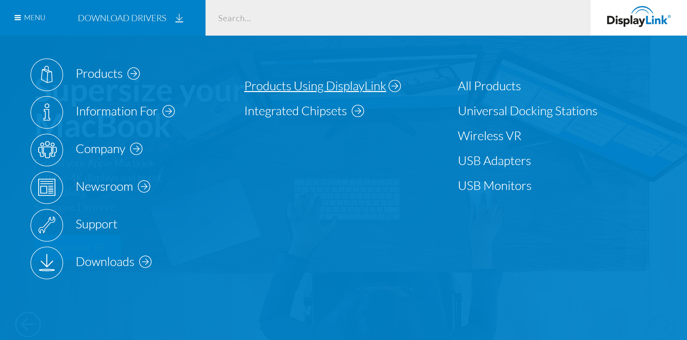
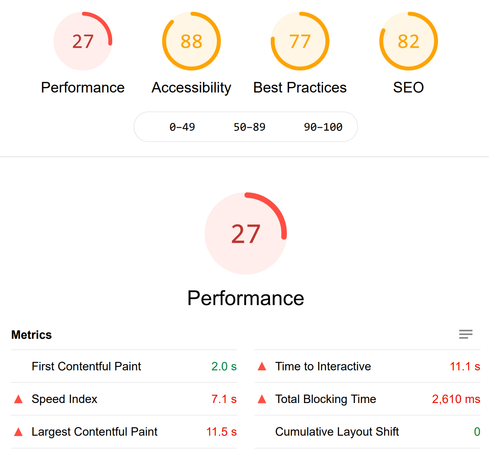
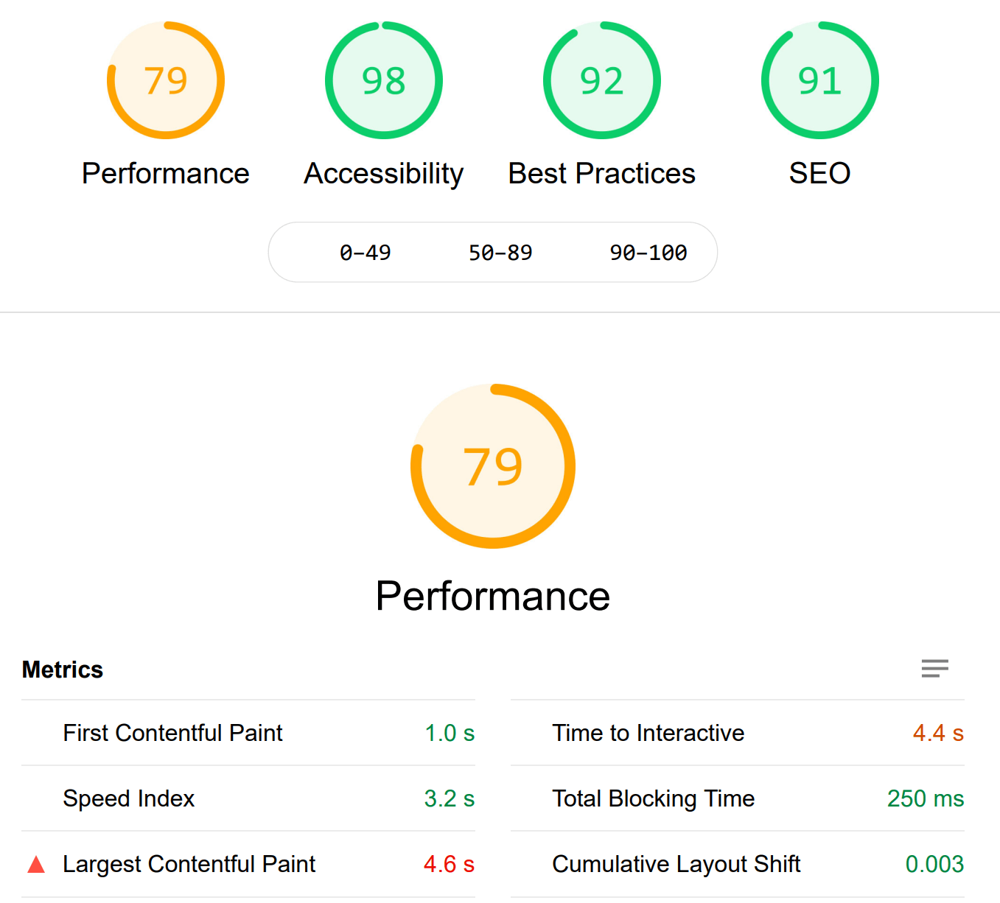


{{ archiveNote }}


DisplayLink's homepage sees approximately 80k page views every month. Most users pass through the homepage on their way to download drivers for DisplayLink chipsets that power multi-display setups in homes and offices around the world.

Early in 2020, the team at DisplayLink approached me to rebuild their homepage, which had been largely unchanged for several years. Decluttering the homepage, and clearly outlining DisplayLink's core offerings and value proposition were central to this redesign.

Another aspect of the project focused on improving navigation across the entire DisplayLink website. The website design at the time featured a nested hamburger menu, with content being hidden up to 3-levels deep at times. With most of the visits to the website coming from desktop users, the team wanted to simplify the navigation to better guide visitors to key sections of the site.

## Design considerations

As the majority of visitors to DisplayLink's website are there to download drivers, we made the decision to make links to the respective driver download pages a prominent part of the new homepage.

A hero section at the top of the homepage provided a space for the marketing team to promote the latest DisplayLink products and features. This replaced a 5-slide carousel which our analysis showed was not driving click-throughs or interactions.

Directly under that, the new design features a series of quick-links to different driver download pages. The aim of this was to improve the most common user journey on the site. By including links to the download pages directly on the homepage, we allowed users to start downloading a driver in 2 fewer clicks.

Further down the page we made the decision to highlight the many global partners DisplayLink works with, as well as the different use cases for its products. DisplayLink's marketing team believed that these details were important in educating visitors to the site about the company.

## Technical optimisations

As part of these design changes, there were several performance improvements made behind the scenes. Those changes included:

- Implementing lazy-loading for images
- Serving modern image formats (WebP)
- Providing multiple images sizes for different viewport widths
- Replacing jQuery with plain JavaScript
- Removing several third-party scripts that were no longer used

Testimonial

> Fershad Digital has transformed the journey and engagement of visitors on our website. The new homepage design delivers significant improvements in key web performance measurements as well as introducing a more attractive and intuitive interface that helps people navigate the site better.

Ben Hall, Marketing Manager at DisplayLink

## Results - faster performance, smaller size

These improvements saw large improvements in speed, size, and performance. Total page size was reduced by 73%. This resulted in a 60% improvement in page load time. When tested using Google's Lighthouse, the result was a greater than 2.5x improvement in the Performance score.

### Lighthouse Results

#### **Before**

#### **After**

With the success of this update the DisplayLink team did have bigger plans to modernise the rest of their website. Unfortunately, shortly after this project was completed DisplayLink was acquired and future upgrades planned for the website had to be shelved.
