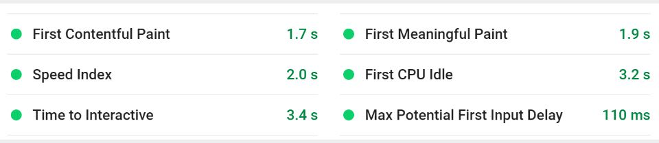
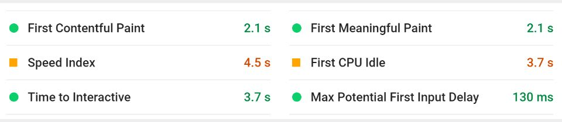
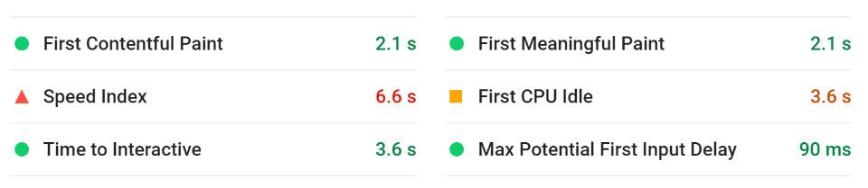


{{ archiveNote }}


## Background & Problem

I've been building websites using the Ruby on Rails framework and hosting them on [Heroku](https://www.heroku.com/) for some time now. [Heroku's free tier](https://www.heroku.com/pricing) is great for deploying websites that have a database-driven backend. However, websites hosted on the free tier go to 'sleep' after a period of inactivity. That means that new visitors might be sitting on a blank screen for some time while the website boots up in the backend. Not a good experience.

Don't get me wrong, I still host some sites that don't get regular traffic on Heroku's free tier. However, for my portfolio site, I wanted as fast load time as possible. To get that I switched to Heroku's 'Hobby' plan. For $7 per month, I was able to ensure my site didn't go to sleep. That met my needs while I was starting out. The cost wasn't an issue as I was still employed full-time as well.

Eventually, though, I started having to think about the costs of running a business without the cushion of a full-time salary.



- Able to save money on website and content hosting with free plans on both Netlify and Sanity.
- Page speed performance improved by removing database layer.
- Allowed me to build a customizable blog for the website fairly quickly.


## Solution - A content-driven static site

While I continued to learn more about web development, frameworks, and all that good stuff, I stumbled across the [JAMstack](https://jamstack.wtf/) & static sites. At first, I wasn't convinced. Sure, a static site might be great for a landing page that doesn't need to change frequently, but maybe it wasn't for me. I had a few requirements for my portfolio site, including:

- The ability to easily add and manage projects
- The ability to add new types of dynamic/editable content (like testimonials)
- I also wanted to build my own customizable blog with backend.

Surely you need to build and host a database for that. Turns out you don't.

As I learnt more and more about JAMstack sites, the more it seemed like a no brainer for me to move my website off Rails and onto the JAMstack.

### Keeping the hosting cost down

Obviously, in making this move, I didn't want to increase the costs associated with hosting my website. Google Analytics was telling me that my website traffic was steady, but not all that significant. I kept this in mind while looking at different hosting options. After a bit of research, I was down to two choices - Amazon Web Services (AWS) or Netlify. I'd heard of AWS but didn't know much about Netlify.

AWS is great for delivering scalable websites and applications. You pay for what you use, which means you can suddenly experience a surge in website traffic and not worry about the site going down. You'll just end up being charged a little extra at the end of the billing month for the extra resources used. This is great for websites that see seasonal or event-related spikes in traffic. [On their website](https://aws.amazon.com/getting-started/projects/host-static-website/), AWS state that it would cost between $1-3 to host a static site.

That said, I finally settled on hosting my website on [Netlify](http://netlify.com/). For a few reasons:

- [Netlify's free tier](https://www.netlify.com/pricing/) provided everything I needed to host my site at no cost. The fact that I could also connect to my domain name, integrate forms, and not have my site fall asleep when not in use were all huge plus points as well.
- Deploying to Netlify is ridiculously easy. By connecting to the Github repo for my website means I could automatically update my website by merely making a commit. If you're not updating content often, there's also a more straightforward drag-n-drop web interface.
- All site files are hosted on a [global content delivery network (CDN)](https://www.netlify.com/products/edge/), meaning load times for visitors are significantly reduced.
- Hosting and other services (like forms) could still be scaled up if I ever encountered a spike in traffic/usage. That said though, if I did need to scale up, then it would cost significantly more than AWS might cost.
- It provides SSL certificate out of the box for all sites for free! So HTTPS is instantly available for my website (for Heroku you get an SSL certificate by upgrading your site to the $7/month Hobby plan).

### But wait, your site is 'static' so it must be harder to edit content

When you hear the term 'static site' it's easy to think that it is a website on which the content remains relatively consistent for the life of the site. That's definitely what I thought when I started out. As it turns out, though, that's certainly far from the case.

The 'A' in JAMstack stands for APIs. APIs allow for one website to request data from another, which it can then process and present. It's with this logic that a whole world of new Content Management Systems (CMSs) have sprung up - Headless CMSs. The entire topic of headless CMSs is something I might delve into in another post later one. Put simply though, but utilizing a headless CMS, I am now able to have a content backend for my website without the bloat of Wordpress, or the need to spin up a database.

Most headless CMS providers also offer a significant degree of flexibility. In my case, this allows me to manage my blog posts and projects through a single backend. It also means that if I need to add any other changeable content later (like testimonials, for example), I can do so with just a few lines of code.

Of the many headless CMS providers, there are out there, I chose to go with [Sanity.io](https://www.sanity.io/). Again, price played a part in this. For what I need from the service, Sanity's free plan provided more than the monthly capacity I require. It is also straightforward to scale and, through Sanity Studio, provides me with a customizable backend for creating and managing content.

## Results

All in all, I've been able to meet the core requirements I had for my website when I set out on the road to moving it off the Rails framework. Some wins from the process have been:

- The only cost that I now have associated with running the website is paying for my domain name.
- I was able to add a completely customizable, scalable backend to my website with minimal effort.
- I no longer have to worry about setting up databases, migrations, etc.
- With the migration, there was also an opportunity to make some revisions to the website structure and content.

But that's all good stuff to me. What about visitors to my site? Well, take a look at the comparison below from [Google Page Speed insights.](https://developers.google.com/speed/pagespeed/insights/) The updated site, running on Netlify, scores better on all performance metrics than the older Rails one. For good measure, I've also included the results of the Rails site running on Heroku's free tier.

**Netlify Free Hosting**

**Heroku Hobby Plan ($7/month)**

**Heroku Free Plan**

Overall, I'm glad I took the time to update and move my site. Sure there were a couple of hiccups along the way, mainly with existing redirects. On the whole, though, I definitely feel things are in a better state now than this time last month. Oh, and I've now got $7 spare change each month to play with!
