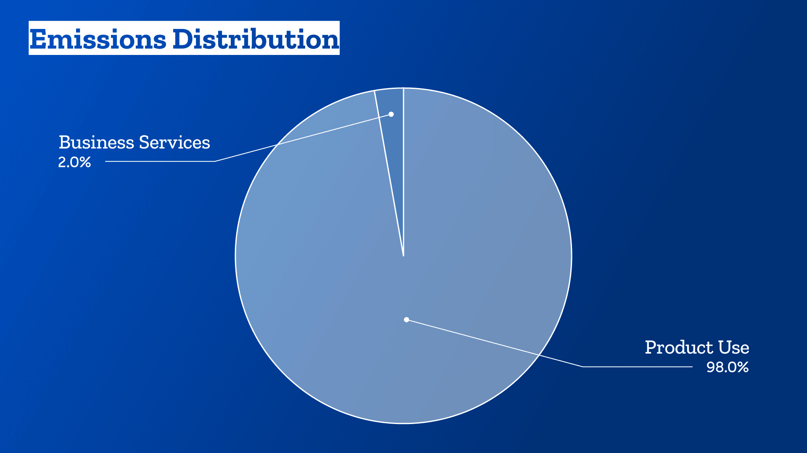

This topic has been on my mind recently, especially since Mike Gifford raised this very [issue in the CO2.js Github repo](https://github.com/thegreenwebfoundation/co2.js/issues/138). That thread is a very interesting read, and one worth following.

It is also a criticism that I see come up a lot aimed at tools which try to present website carbon estimates. With WebPageTest releasing their [Carbon Control](https://blog.webpagetest.org/posts/carbon-control/) test feature recently, and that hopefully drawing more attention to the area of website sustainability, I wanted capture some of my thoughts on this topic.

## So, is data transfer a good proxy?

No, data transfer probably isn’t the best proxy from website carbon emissions. Right now, though, it’s _the best we’ve got_ given the tools and knowledge available to us.

[I’ve written about this in the past](https://fershad.com/writing/website-carbon-beyond-data-transfer/). Ideally, we’d be able to use actually energy consumption figures at both the server & device level to work out how carbon intensive a webpage is.

There seems to be a growing consensus that network energy utilisation doesn’t correlate 1:1 with data transfer over said network. So that’s another part of the system we need to reevaluate.

Additionally, there’s no easily programable access to energy usage information (especially on the device) just yet. This makes it especially difficult for testing/measurement tools like WebPageTest to use anything other than data transfer for carbon estimates. Until there is, and in the absence of peer-reviewed research into the energy consumption of different media/file types, data transfer is a measurable metric that gives us a general sense of how carbon intensive a page **_might be_**.

## Why even bother with the frontend?

With all that said, why should we even bother with estimating frontend website carbon emissions. Considering that current methodologies use data transfer as the key proxy for carbon emissions, shouldn’t we just focus our attention on the server level where we can get meaningful real energy consumption data?

Firstly, the impact of devices (i.e. frontend) is significant. One only needs to look at [**Mozilla’s own greenhouse gas emissions findings**](https://blog.mozilla.org/en/mozilla/release-mozillas-greenhouse-gas-emissions-baseline/). While it’s not specific to websites, it is a pretty clear indicator at the business level that the emissions from usage of ones products can be a large portion of total operational emissions.

As I mentioned earlier, network data transfer is **_the best we’ve got for now_** Our understanding, and access to different sources of information will evolve. As more people become aware (partly through tools like [Website Carbon Calculator](https://www.websitecarbon.com/), Carbon Control etc), we’ll have more minds thinking about this problem. And with all that, we’ll gradually move away from using data transfer towards more accurate indicators.

### Referencing accessibility and performance

I wasn’t actively involved in the web industry when accessibility or performance started becoming a concern people wanted to test for. But, I can image that in those early days the tooling to test, measure and report on both were limited. Despite that, we didn’t stop testing accessibility or performance. Rather, folks in the field worked with what they had at the time and behind the scenes worked on ways to improve those tools/metrics. Website sustainability, I feel, will follow the same path.

## What could to replace data transfer in the future?

Let’s end by talking about the future. What might come in to replace data transfer in our website carbon estimation models over the next one to five years?

### Carbon data in HTTP headers

This would be **the best** At the very least it would help provide real transparency about datacenter and network level emissions. Effectively, we’d have carbon emissions data sent along with every request on the internet. That would allow for significantly more detailed estimates to be produced.

There’s a [proposal out](https://www.ietf.org/archive/id/draft-martin-http-carbon-emissions-scope-2-00.html) at the moment, which is very early doors. There’s also this paper by my Green Web Foundation colleague Chris Adam and others on [how the IPv6 protocol could be leveraged](https://www.thegreenwebfoundation.org/publications/extending-ipv6-to-support-carbon-aware-networking/) in a similar way.

### Research into the frontend energy usage of specific file types

There’s already [a paper by Alexander Dawson](https://websitesustainability.com/cache/files/research23.pdf) exploring this. It would be great to see more work in this space, at it would further help refine how frontend carbon emissions estimates are produced.

There’s long been a belief that 100kb of JavaScript or video content has a much larger device-level impact than 100kb of HTML. Having research to back that up will allow for updated models to be created with this information baked in.

### Device-level energy/emissions reporting built into browser dev tools

Currently, measuring device energy usage requires having dedicated infrastructure to perform measurements and tests. For this data to become more widely usable, it really needs to be built into browsers. We’ve seen [Firefox take steps](https://fershad.com/writing/co2e-estimates-in-firefox-profiler/) in this direction, and Microsoft Edge have [indicated they’d like to explore this](https://fershad.com/writing/microsoft-propose-sustainability-section-in-edge-devtools/) as well.

Another key piece of this will be to have this data be programmatically accessible so that developers can build tools and tests around it. A combination of this, plus the HTTP headers stuff mentioned above would revolutionise how website carbon emissions are measured.

## Where to from here?

Let’s keep chipping away at this, fam. While data transfer as a proxy might not provide the most accurate carbon emissions estimates, it’s what we’ve got to work with at the moment. Our understanding of this space will continue to evolve, and with that the tools, data, and metrics we use will change too.

Right now, though, raising awareness is almost as important as generating hyper-accurate CO2 figures. Digital sustainability needs to become part of the broader consciousness, and tools like Website Carbon, Carbon Control and [Ecograder](https://ecograder.com/) all help serve this mission.

Folks in IT have a lot of leverage with their decisions. The more who know that they **_can_** [select green hosting providers](https://www.thegreenwebfoundation.org/directory/), or that they **\*\***should**\*\*** _try to_ follow [Sustainable Web Design](https://sustainablewebdesign.org/) practices, the better off we’ll all be in our mission to lower the environmental impact of our sector.
