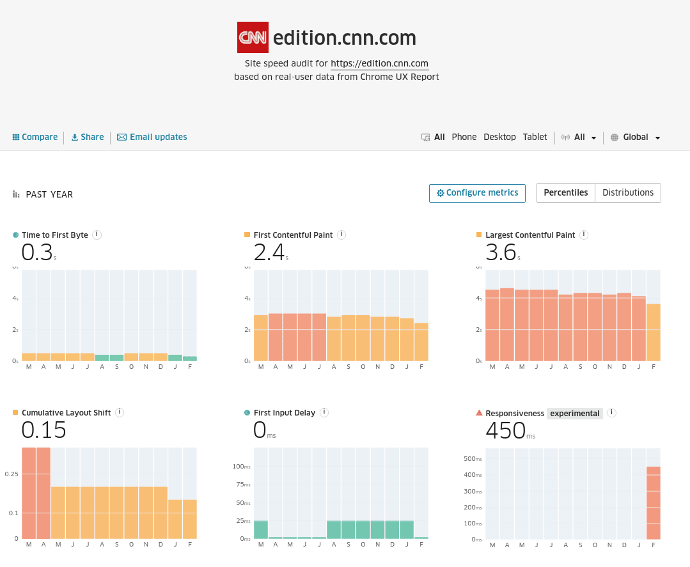

In [a blog post last June](https://web.dev/better-responsiveness-metric/), Google tabled some of the ways it was looking to improve capturing and reporting on website responsiveness. [Last November](https://web.dev/responsiveness/) they put forward details of a new responsiveness metric that would go beyond what is currently measured by First Input Delay (FID).

Now, in March 2022, experimental reporting of this new responsiveness metric has become available in the Chrome User Experience (CrUX) dataset. Data is available starting from February, 2022.

## What is the new responsiveness metric?

To summarise it down to a few short points, the new responsiveness metric aims to:

- Capture the full duration of interaction events.
- Group events into interaction types. For example, a keypress would consist of a `keydown` and `keyup` event.
- Aggregate all events for a page visit.

The blog posts linked to in the previous paragraph go into much more depth on this.

## How does it differ from FID?

FID measures the time the browser takes to begin responding to a user interaction event. It’s very much an “under the hood” metric, as it deals with main-thread responsiveness. As the Google team acknowledge:

> FID does not include the time spent running those event handlers, nor any work done by the browser afterwards to update the screen. [**Towards a better responsiveness metric**](https://web.dev/better-responsiveness-metric/#what-improvements-are-we-considering)​

Good FID does not guarantee good responsiveness scores, as is highlighted by the data for [edition.cnn.com](http://edition.cnn.com) below.

## How can I start checking my site’s responsiveness?

If you want to query the [CrUX BigQuery](https://developers.google.com/web/tools/chrome-user-experience-report/bigquery/getting-started) dataset, you can surface responiveness data with `experimental.responsiveness` ([release notes](https://groups.google.com/a/chromium.org/g/chrome-ux-report-announce/c/F7S4_emZkcw?pli=1)). The team at Treo have also updated their free [Site Speed report](https://treo.sh/sitespeed/) to show the new metric.
