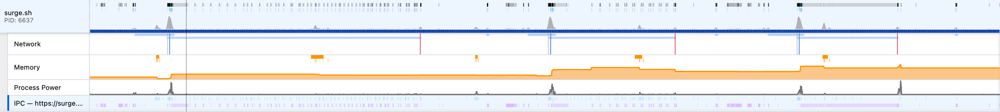
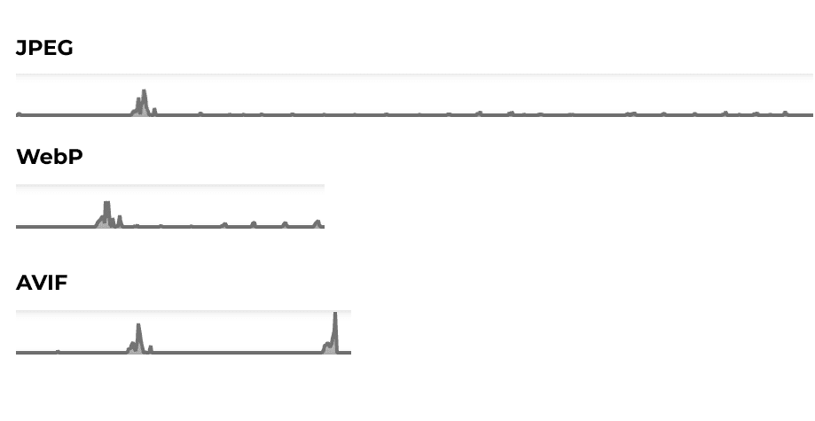

Earlier this year, I worked on getting [carbon emission estimates into the Firefox Profiler](https://fershad.com/writing/co2e-estimates-in-firefox-profiler/). Since then, I’ve had an itch to use the Profiler to test out the actual power usage of some _stuff in the browser_. In this post, I’ll be scratching the first of those itches - image formats.

## Testing image formats

For a while, I’ve wondered just how much power gets used **on a device when it loads an image**. There’s plenty of guidance for developers to use modern image formats like WebP and AVIF which generally have a smaller file size compared to older formats like JPEG. That makes sense from a performance perspective. The smaller the image file, the less time it will take to transfer over the network, and the sooner it can be made visible on a user’s device.

What I’ve been wondering about, though, is what happens **when the image actually reaches the user’s device**. Are modern formats, with smaller file sizes, also less power hungry as the user’s browser downloads, decodes & renders them?

### What we’re testing

To test this out, I’ve created a set of simple web pages that load a single (large) image of a different image format. The formats I’ve ended up testing are:

- JPEG
- WebP
- AVIF

Each page contains a single `` tag that loads the image in that particular format. The `` tag also has some alt text, as well as height and width attributes. There is no other CSS or content on the page. This would allow me to see power consumption when the images are loaded as they would be on any regular webpage, via a HTML `` tag.

The original image was in JPEG (.jpg) format. The WebP and AVIF versions were generated in the [Squoosh](https://squoosh.app/) app, using the default settings for each of those formats.

I also created an index page to link to each of those image pages. You can find [all the source code on GitHub](https://github.com/fershad/ff-profiler-img-format-test). Finally, I uploaded the pages to a server on the internet using [Surge.sh](http://Surge.sh) so that the tests could be run over a real network. You can find it at [https://ff-profiler-img-type-test.surge.sh/](https://ff-profiler-img-type-test.surge.sh/).

As an aside, the image I used for testing is shown below. It’s a banger of a shot I took during a recent holiday in Tasmania, Australia. The night mode on the Google Pixel 7 is something else man.

### How tests were run

All tests were run on my local machine using a version of Firefox Nightly browser. Details of the platform are below:

- **Browser:** Firefox Nightly 118.0a1
- **OS**: macOS 13.4.1
- **ABI**: aarch64-gcc3
- **CPU model**: Apple M2
- **CPU cores**: 8 physical cores, 8 logical cores


The fact that I’m running the test on an Apple Silicon powered Macbook is important to note here. Power profiling in Firefox works in different ways depending on the operating system and hardware being used.

On Linux and Windows (Surface devices), the power profile will capture power usage for the entire browser (including inactive tabs, and extensions). On Apple Silicon (M1 and M2), though, the profiler is able to show power usage of individual processes. In this way, I can easily isolate the specific tab in which I was performing the test and get only it’s power consumption results.


I used the Firefox Profiler’s default power profile settings to capture each test run. I won’t go through how to do that, since I’ve already covered that in the [post linked to at the start](https://github.com/fershad/ff-profiler-img-format-test) of this article.

When running each test, webpages and image files were all served from my local machine (localhost). Each test run followed this sequence of steps:

- Open the index page ([https://ff-profiler-img-type-test.surge.sh/](https://ff-profiler-img-type-test.surge.sh/))
- Start the Firefox Profiler
- Open the JPEG page, and let the image load
- Go back to the index page
- Open the WebP page, and let the image load
- Go back to the index page
- Open the AVIF page, and let the image load
- Go back to the index page
- Stop the Firefox Profiler

I ran three tests to capture performance of uncached images. For these tests, I cleared the browser cache between each test run. I also ran three tests to capture performance on images served from cache, but I closed the browser between each of those runs.

### My hypothesises

I did go into this exercise with some ideas about how power hungry each image format would be. In a nutshell, I expected the newer formats (WebP and AVIF) to use more power than JPEG. I expect AVIF to be the most energy intensive, because I remember reading something about [it needing more CPU power to decode](https://www.notion.so/7ffd63400ccf40ea8a6481b6a511402c?pvs=21).

## The results

After running the tests, I ended up with six profiles (three cached, three uncached). I’ve made those public, and you can find links to them below. First up, here’s a TL;DR of the key findings:

- Across all tests, loading the WebP page had the lowest energy consumption.
- Across all tests, loading the AVIF page had the highest energy consumption.
- JPEG was close to WebP in most tests.
- The uncached tests are fairly consistent. Testing when images are cached, however, has some wild variability. More testing is probably needed there.


When reading these test results, please remember that the tests are very rudimentary and have a very small sample size. Further testing is required in this space to fully understand in detail the energy consumption of these (and other) image formats.


### Results in detail

Running each test resulted in a timeline that looked like the one below. You can see three bumps in the **Process Power** track. These correspond to loading each image page.

In order to determine how much power was consumed loading each page individually, I selected each part of the timeline beginning at the pointerup DOMEvent that triggered my navigation to the image page, and ending at the [MozAfterPaint](http://www.devdoc.net/web/developer.mozilla.org/en-US/docs/Web/Reference/Events/MozAfterPaint.html) [DOMEvent](http://www.devdoc.net/web/developer.mozilla.org/en-US/docs/Web/Reference/Events/MozAfterPaint.html) that fired after the image image finishing loading.


Before getting to the results, it should be noted that we’re dealing with some really small numbers here. Figures are shown in microwatt hour, or µWh. Alongside them, I have presented the equivalent kilowatt hour (kwh) value.


In looking at the results, I have only examined the energy consumption shown in the profiler and _not_ the carbon emissions estimate that’s presented alongside it. The reason for this is that the carbon emissions estimate are calculated using global average grid intensity, and would not accurately reflect the **\*\***actual**\*\*** emissions at my location (Taiwan) when running these tests. In any case, energy consumption is a good proxy for emissions in this case - the more energy used, the greater the resulting emissions, no matter what the grid intensity is.

#### No cache

**Profiles: [Test run 1](https://share.firefox.dev/3EjXzSl), [Test run 2](https://share.firefox.dev/3QUmqUo), [Test run 3](https://share.firefox.dev/44sJzAC)​**

Transfer sizes:

- JPEG: 1.51 MB
- WebP: 421 Kb
- AVIF: 254 Kb

**JPEG**

- Test 1: 103 µWh (0.000000103 kwh)
- Test 2: 110 µWh (0.000000110 kwh)
- Test 3: 109 µWh (0.000000109 kwh)

**WebP**

- Test 1: 103 µWh (0.000000103 kwh)
- Test 2: 106 µWh (0.000000106 kwh)
- Test 3: 100 µWh (0.000000100 kwh)

**AVIF**

- Test 1: 137 µWh (0.000000137 kwh)
- Test 2: 137 µWh (0.000000137 kwh)
- Test 3: 133 µWh (0.000000133 kwh)

Looking at these results there’s not much between JPEG and WebP. In 2 out of the 3 tests, WebP uses marginally less energy, but not by any significant margin. AVIF, though, is consistently using about 30 microwatt-hours more electricity than WebP across all three tests.

It’s also really interesting to see the power consumptions as the images load. The below image compares the three formats. It’s curious that AVIF has two spikes in consumption, while JPEG and WebP have one main spike and a series of much smaller bumps. Could this be because of how the AVIF file is decoded before it is rendered on the screen?

#### Cached

**Profiles: [Test run 1](https://share.firefox.dev/45MkNfE), [Test run 2](https://share.firefox.dev/3stcZRQ), [Test run 3](https://share.firefox.dev/47LrZdZ)​**

**JPEG**

- Test 1: 79 µWh (0.000000079 kwh)
- Test 2: 141 µWh (0.000000141 kwh)
- Test 3: 118 µWh (0.000000118 kwh)

**WebP**

- Test 1: 116 µWh (0.000000116 kwh)
- Test 2: 119 µWh (0.000000119 kwh)
- Test 3: 69 µWh (0.000000069 kwh)

**AVIF**

- Test 1: 158 µWh (0.000000158 kwh)
- Test 2: 151 µWh (0.000000151 kwh)
- Test 3: 74 µWh (0.000000074 kwh)

What a mess! There’s next to no consistency when images are served from cache. I wonder if that’s got to do with something that’s happening as the browser tries to access the file system? Definitely should have run some more tests here!

Looking at the average of these results, WebP again uses less energy across the three tests. JPEG isn’t too far off as well. And once more it’s daylight to AVIF, which consumes the most energy on average.

In the cached tests, I was also seeing more of the “double spikes” of power consumption, similar to what I highlighted about for AVIF. However, this time these double spikes were happening across all three formats, but did not occur consistently for all formats in all three tests.

## What conclusions can be drawn?

This was a fun little exercise to carry out. I managed to scratch an itch, and have come out the other side with even more thoughts, ideas, and itches to be scratched.

**These tests are also on a very small sample size and so any conclusions drawn from them should ideally be tested further.** The Firefox browser, and how it works, probably impacts the results somewhat, and I wonder how they might differ on Chrome and Safari. Alas, right now there’s no way to test energy consumption in those browsers.

Also, I’m far from an expert in images or browser engines. It would be nice to gain a better understanding of how both of those work. This [Jon Sneyers post on Cloudinary’s blog](https://cloudinary.com/blog/contemplating-codec-comparisons) looks like a good place to start.

### Should you switch to WebP?

To be honest, I wasn’t expecting WebP to be the most energy efficient format when I started out. I am really impressed by how consistently it was less power hungry compared to JPEG and AVIF.

So, should you switch your site to use WebP based on _these_ results? For sites that only have a handful of image, I’d say nah your time is definitely better spent elsewhere. From a website performance perspective, though, if you’re using JPEG then by all means look for ways to move to one of the newer formats like WebP or AVIF. It might help boost some of those performance metrics which Google cares about.

For sites with a lot of images (news websites, galleries etc.) a switch to WebP might be a something worth looking into with a bit more research. It’d be interesting to see if/how these results change when there are multiple images on the page, and maybe a bit of CSS to resize them. That’s an unscientific test for me to run on another day though.
