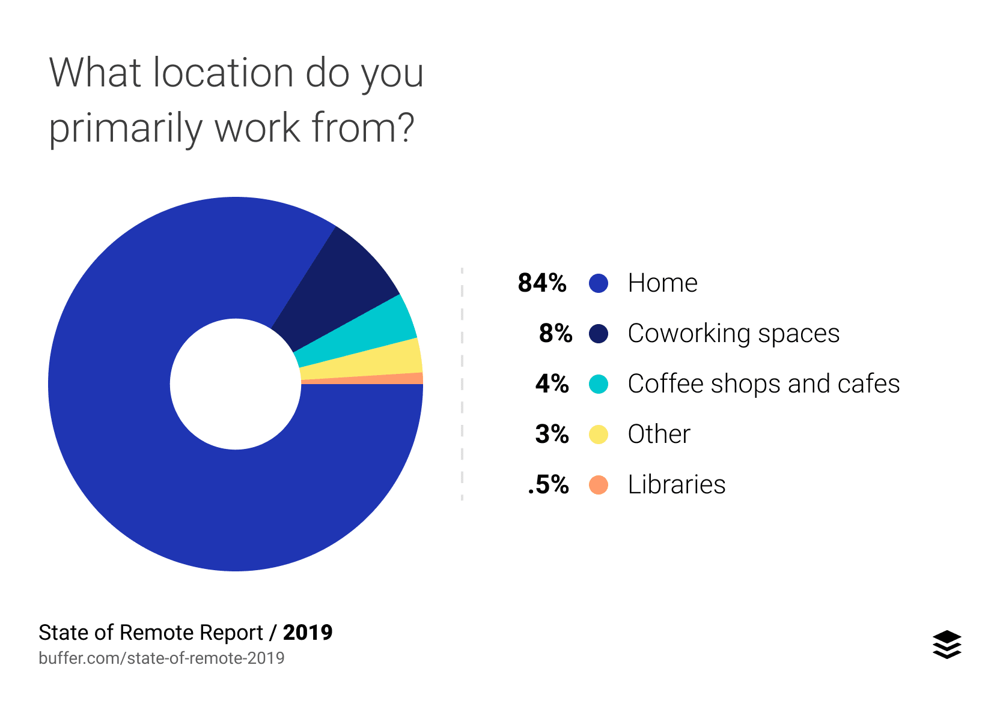
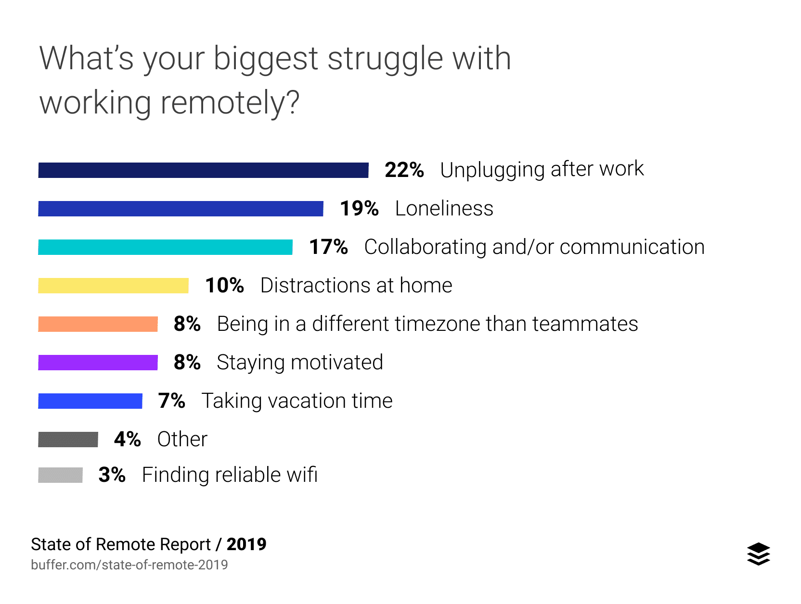
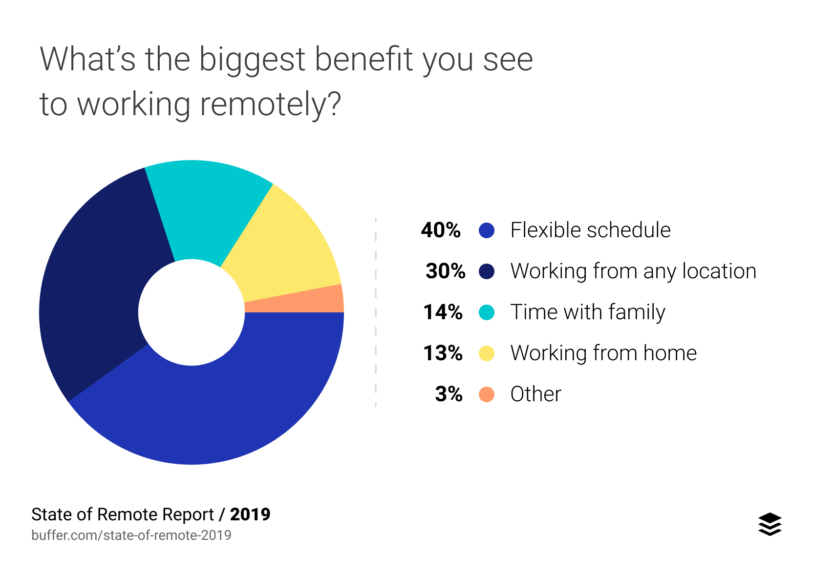

Last month, Buffer published their annual "State of Remote Work" report for 2019. I stumbled across it recently during a spell of general internet wandering. I read it, wanting to see how my remote working life (albeit in its infancy) stacks up against my peers globally. In doing so, I also took the opportunity to take a look at just how things have panned out for me so far. Below are my musings, paired up with some excerpts from the [2019 State of Remote Work report](https://buffer.com/state-of-remote-work-2019).

_Aside: The findings are a good read for **both employees and employers**. It also introduced me to a fantastic new term to describe remote workers - "**office-optional professionals"**._

## Background

A little over two months ago, I turned in my office swipe card and took the first steps towards being a solopreneur (freelancer, if you must). It's always a big step moving onto something new. From a business standpoint alone, I've already learnt a heck of a lot in these last two months. That includes:

- The process through which to establish a business here in Taiwan and what requirements there are to do so.
- Understanding Taiwan's corporate tax system and the various ways in which businesses can operate within it.
- Having to arrange for my own National Health Insurance. (Normally in Taiwan employers are obligated to do this for employees).
- Setting up bank accounts, email services, designing and printing business cards ... the list goes on.

## Working remotely - Two months & counting

So, what's it been like to break the shackles of a 9am - 6pm working day? Well, to be fair, it does have many upsides but as a friend of mine who also works from home pointed out - "in the end work is still work". Here's how it has panned out so far.

### I work from home more than I thought I would

I really wasn't expecting this. I had always pictured myself working out of cafes more often than not. It also surprised me to see that the overwhelming majority of remote workers polled by Buffer also chose home as their primary place of work (graphic below). Part of my preference for staying home is that it is overall the cheapest of all the options. It's also just easier. There's no worrying about finding a place, remembering to pack all your gear, or commuting (especially in Taipei's humidity and rain).

My personal order of preference for this question would be:

1. Home
2. Libraries
3. Coffee shops and cafes

Being introverted by nature, and really not minding time alone, I haven't yet tried a coworking space. I'm not convinced that it would be the right environment for me to work effectively. Also, right now, it's an expense I can avoid. Who knows, I might be proven totally wrong if/when I give coworking a shot.

### Switching off. The struggle is real

While I was an office-mandatory professional, I would make a point of not working extra hours or taking work home unless I really needed to. Now, I'm at home most of the time, and so is the work. This has made unplugging from work a real struggle. From Buffer's report, it seems to be something that a lot of other remote workers also have an issue with.

In my case, I feel that one contributing factor is not having a separate office space where my work equipment is kept. I share a small 30 square meter studio apartment with my girlfriend and cat. It means that my laptop is always within easy reach, and I've often found myself working on something well past 10pm. It's not something that my girlfriend appreciates, and is definitely something that I am working to curtail. Some of the strategies I'm putting in place to do so are:

- Blocking out time for work in my calendar and sticking to them (this _should_ also help to develop a bit more self-discipline).
- Noting down any ideas that spring into my mind on paper and returning to them the next morning.
- Keeping my laptop somewhere where I cannot see it.
- Trying to establish a reading schedule of non-tech/web development content.

### Flexibility is great, but you've still got to work

Having flexibility of schedule is definitely one of the major drawcards of working remotely. Errands can be run during the day, morning or afternoon bike rides can be planned, meetups can be easily arranged.

Of course, somewhere amongst all that work has to get done too. And that's been one of my biggest learnings in the last two months. The flexibility of schedule is excellent, just don't get swept up with it.

I have found myself at times realising that although I've been able to knock off a lot of household chores and errands, work that I had planned to complete for that day remains incomplete. That then feeds into not unplugging from work, and so a vicious cycle begins.

In a bid to change that, I have started trying to plan out my weeks in advance as best I can. This allows me to either set aside a day to get through all errands that need attending to or to spread them out across different days over a week. I find the latter approach to be a bit better, as it helps break up the days a bit, and also gets me out of the house more regularly.

### It's great being back on my bike

This one's a personal one, and not in the report obviously. About a month into working remotely, I realised that for me to go anywhere during the day ate up a good deal of time and money. Whether it was just heading out to get lunch, going to a library or cafe, or running some errands, it was just not efficient to rely on public transport or my own two feet.

To speed things up, and save some money, I've started riding my bike again. Besides the time and cost savings, there are also obvious health benefits to be gained from commuting by bike. Getting around Taipei is relatively easy. It's a reasonably bike-friendly city (though there's still plenty of room for improvement). Being able to ride directly to wherever I need to go, rather than navigate the metro and buses is also a huge plus.

Oh, and it also has given me greater freedom to explore more of the city I've called home for the past seven years. Not bad.

## Conclusion

Those are just my experiences from the short time that I have been a remote worker. Though not everything has turned out how I imagined, it was reassuring to see just how similar my situation is compared with others around the world.

Making the leap has been, and continues to be, a great learning experience. So has writing this blog post. It has allowed me to reflect on what I've been through and how things are going. It's an exercise I might look at doing again in a few months.

All images above are taken from the [State of Remote Work 2019](https://buffer.com/state-of-remote-work-2019) report, published by Buffer.
