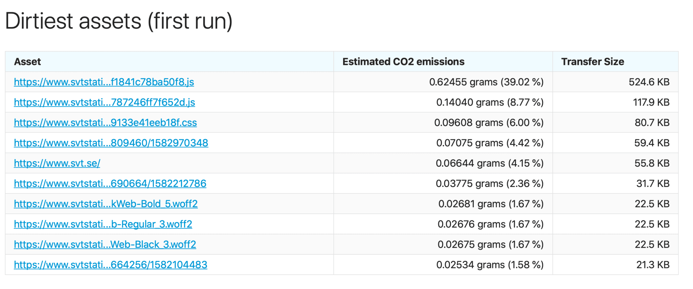

_This post was originally published on [The Green Web Foundation's blog](https://www.thegreenwebfoundation.org/news/sitespeed-io-using-and-contributing-to-co2-js/)._

Visiting a fast website is always a pleasant experience. In fact, most of the time you won’t even notice that a website is fast. But you sure will notice when one isn’t! The field of website performance exists, in part, to aid website owners in creating these unnoticeable, pleasant experiences. And doing so can be [worth](https://www2.deloitte.com/content/dam/Deloitte/ie/Documents/Consulting/Milliseconds_Make_Millions_report.pdf) [_a lot_](https://www2.deloitte.com/content/dam/Deloitte/ie/Documents/Consulting/Milliseconds_Make_Millions_report.pdf) to companies operating online.

There are several services that allow users to monitor the performance of an entire website. Most are paid, and most focus primarily on website performance metrics. That makes [sitespeed.io](https://sitespeed.io/) a bit of an outlier in the web performance monitoring space. For one, sitespeed is entirely open source. Second, it is currently the only dedicated performance monitoring tool which also allows users to get carbon emissions estimates for every page of their site.

## A VERY BRIEF HISTORY OF SITESPEED.IO

The sitespeed project started in 2012 (happy 10 year anniversary!) when [Peter Hedenskog](https://github.com/soulgalore) committed the first lines of code. Peter, who now works in the performance team at the Wikimedia Foundation, initially built sitespeed for consulting work. His aim was to have something that could crawl an entire site, and run performance tests to identify troublesome pages.

Fast forward a decade, and sitespeed is now one of the most well-rounded performance monitoring tools available. A core tenant of the project is to give users the ability to own their own data, and run sitespeed on infrastructure of their choosing. It can be run in Node or using Docker. The resulting metrics can be used to create monitoring dashboards in Grafana and Graphite.

You can hear more about Peter & sitespeed story on [episode 212 of The Changelog](https://changelog.com/podcast/212).

> _I think we as developers have a lot of responsibility and power to make the world a better place. There are many decisions at everyday work, where if you choose to you can be a conscious developer that makes choices which make the world better. In practice, that could be to open source your work, make sure your workplace treat people equally independent of gender/background, choosing local companies over big tech giants for hosting or, if you have the luxury to choose, not working for companies that do evil. Or, it could be as easy as contributing some code to a library that does good._
>
> **\-Peter Hedenskog**

## SUSTAINABILITY ENTERS THE PICTURE

As web performance metrics evolved through the late 20-teens, so did sitespeed. Peter and his co-contributors have always kept the core goal of building the best possible web performance monitoring tool.

> _My main focus is to build the best web performance tool with_ [_sitespeed.io_](http://sitespeed.io/) _but since we already access a web page, there’s a lot of other things we can do quite easily like run accessibility tests or test co2.
>
> **\-Peter Hedenskog**

The idea of estimating website carbon emissions wasn’t something that sitespeed’s core team had on their roadmap initially. But all that changed when Peter reached out to the Chris Adams at the Green Web Foundation on Twitter, asking about a collaboration:

![Screen shot showing the following exchange:  Peter asking on twitter: @mrchrisadams I would love to include a green plugin to http://sitespeed.io as GreenHouse (or better). There’s a plugin architecture so it should be doable. Also interesting in your calculations for CO2 vs bytes? If I start, could you help me verify that I get it right?  Chris, replying on twitter: Oh dude, I've literally been planning that this month, and reading over the sitespeed docs to figure out how to make that plugin! I'd _love_ to collaborate on this. Can you DM me your preferred email for correspondence?](../../public/img/blog/f2b49abdc3643ea5af3085d951e7bd45e41b7d9f-1284x1382.png)

Working together, Chris and Peter were able to get a first version of the sitespeed plugin built and released within a few weeks. Along the way, Peter noticed a few things that could be improved in CO2.js itself, and so contributed back to the project. In doing so, he became one of the first contributors to CO2.js.

## WHAT DOES THE SITESPEED SUSTAINABILITY PLUGIN DO?

**Sitespeed’s sustainability plugin returns an estimate of carbon emissions in grams for one page view.** It provides breakdowns by page for:

- First-party resources
- Third-party resources
- Emissions by domain
- Emissions by content type
- Dirtiest assets

You can read more about each of the breakdowns above, and how to use the plugin, in the [sitespeed docs](https://www.sitespeed.io/documentation/sitespeed.io/sustainable/).

Sitespeed’s code is entirely open source, so if you want to get a deeper look into the sustainability plugin then head over to the [repository on Github](https://github.com/sitespeedio/sitespeed.io/tree/main/lib/plugins/sustainable).

For privacy reasons, the sitespeed team don’t collect any metrics on who or how the tool is used. However, Peter did reveal that Wikimedia uses it for monitoring the performance of their services, and that he actively uses the sustainability plugin internally in his role.

With an online presence as large as that of the [Wikimedia Foundation](https://wikimediafoundation.org/), the performance team is constantly running tests to improve and optimise pages across their various entities. As part of the tests he runs, Peter uses the sustainability plugin to baseline how pages compare to each other as well as to other companies/organisations.

As an aside, the Wikimedia Foundation also release a [yearly sustainability report](https://meta.wikimedia.org/wiki/Sustainability). While this report doesn’t include website carbon emissions, it does include some really insightful information of Wikimedia’s emissions and energy usage at the data center level.

## HOW DOES SITESPEED USE CO2.JS?

**CO2.js is an open-source JavaScript library that enables developers to estimate the emissions related to use of their apps, websites, and software.** It is built to reduce the barrier to entry for developers who want to build carbon estimates into the apps and sites they build.

> _My main focus is to build the best web performance tool with_ _[sitespeed.io](http://sitespeed.io/). I could never build co2.js, because I lack the domain knowledge._
>
> **\-Peter Hedenskog**

Pairing sitespeed’s web page data transfer and requests data with CO2.js allowed sitespeed’s sustainability plugin to estimate carbon emissions based on data transfer.

Sitespeed also uses CO2.js to perform green hosting checks on the domains it collects when scanning a page.

### Carbon emission estimations

To turn page data into carbon emissions estimates, sitespeed takes a snapshot of a web page using it’s own [PageXray library](https://github.com/sitespeedio/pagexray). With the information about the page and all its requests available, CO2.js can then get to work.

Sitespeed’s sustainability plugin [uses the One Byte model](https://developers.thegreenwebfoundation.org/co2js/explainer/methodologies-for-calculating-website-carbon/#the-onebyte-model) for carbon estimations by default. However, to align with [recent changes in CO2.js](https://www.thegreenwebfoundation.org/news/release-guide-co2-js-v0-10/), the team have also introduced the ability for users to manually change to the [Sustainable Web Design model](https://sustainablewebdesign.org/calculating-digital-emissions/) instead.

Peter’s contributions helped extend CO2.js to cover some common requirements for running website performance tests. He contributed the `perParty`, `perDomain`, `perPage`, `perContentType` and `dirtiestResources` methods to use PageXray JSON data to generate results for the sustainability plugin.

### **Green host checks**

CO2.js provides [a nice wrapper](https://developers.thegreenwebfoundation.org/co2js/tutorials/check-hosting/) around The Green Web Foundation’s [Greencheck API](https://developers.thegreenwebfoundation.org/api/greencheck/v3/check-single-domain/). This allows developers to very quickly implement checks for one or multiple domains against the Foundation’s Green Domains dataset. Sitespeed uses this to check for green hosting on all the domains used by a given web page.

## MEASURING SUSTAINABILITY NOW AND INTO THE FUTURE

So, what about the future? Peter hopes for a more proactive world, where browsers warn users of sites that might be consuming too many resources. We’re already seeing some movement in this direction. The Ecosia search engine [highlights planet-friendly organisations](https://blog.ecosia.org/green-search/) in its search results. Meanwhile, Google has also started to [surface sustainability information and nudges](https://blog.google/outreach-initiatives/sustainability/sustainability-2021/) across several of its products.

> _I think it would be cool if web browsers themselves could warn users if a web page consumes a lot of energy, the same way Mac OS warns about applications that drain the battery. Next step would be that the browser warns the user before going to the page: do you really want to access this wasteful website?_
>
> **\-Peter Hedenskog**

Like Peter, we’d love to see sustainability built into the browser, and even web standards. We’ve been working with the Firefox team to [add carbon emissions estimates to their DevTools profiler](https://github.com/firefox-devtools/profiler/pull/4243). Open-source projects like [sitespeed.io](http://sitespeed.io/), open data, and active engagement by the web community all have an important role to play in getting us to a greener, more carbon-aware internet.
