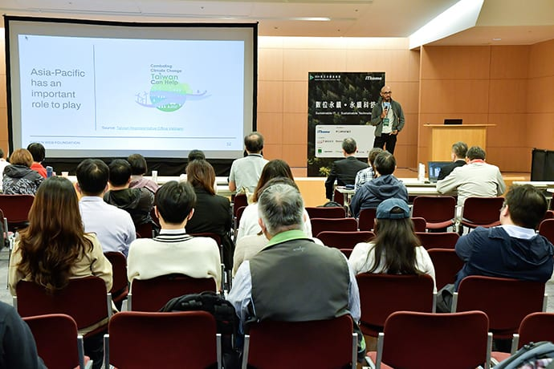

_This post was [first published on the Green Web Foundation's blog](https://www.thegreenwebfoundation.org/news/speaking-about-green-it-in-asia-green-io-conference-singapore-and-more/) on April 25, 2024._

Tackling the climate crisis is a global challenge, and one that is not restricted by geographic boundaries. This is something that we, as a team, acknowledge at [our recent team days in Berlin](https://www.linkedin.com/posts/hanopcan_digitalsustainability-activity-7174409712384249857-yjAT?utm_source=share&utm_medium=member_desktop). Until recently, a lot of our work as the Green Web Foundation has been focused in Western Europe where the organisation was founded and where the majority of our team have been based. So when the opportunity came up to speak at events in Asia about the digital sustainability work that’s close to our heart, we couldn’t say no.

## A bit of context first

A lot of the pioneering work in the fields of digital sustainability and green IT has taken place in Europe and the United States. Meanwhile, emerging regions like Asia are seeing a rapid expansion in demand for IT services and infrastructure. It is paramount that this expansion is done sustainably, and in a way that does not further push us beyond planetary boundaries. The ICT sector in Asia has the opportunity to not just grow, but to grow green, and that’s an opportunity we believe should not be let slip.

Since I joined the Green Web Foundation on a more regular basis in mid-2023, we’ve been looking for a way to utilise my presence in ✨_the future_✨ (aka the Asia-Pacific region/time zone) to expand the reach of the organisation. As the region slowly opened back up after the COVID-19 pandemic, we were hopeful that a few opportunities might arise. And so when we heard from Gael Duez that he was planning to host a [Green IO Conference in Singapore](https://greenio.tech/conference/2/singapore-2024-greenit-digital-sustainability) in April, we made sure to keep our diaries free.

As an extra bonus, we were also invited to speak at the [Digital Sustainability Summit](https://dss.ithome.com.tw/) in Taipei, Taiwan (where I’m based) at the end of March. A terrific chance to learn about what’s happening locally for me, and share our work with folks closer to home.

## GREEN IO CONFERENCE SINGAPORE

The Green IO Conference in Singapore was run alongside the [Apidays conference](https://www.apidays.global/singapore/) on April 18th, 2024. Pairing the conferences allowed for the topic of tech sustainability to be clearly visible alongside hot industry trends like AI (and boy there were a lot of talks about AI at Apidays). It provided a platform for Green IT practitioners to connect and share their insights with not only likeminded individuals, but also attendees for whom digital sustainability may be a new idea.

I’ve known Gael since day one of Green IO, as the podcast’s [first ever guest](https://greenio.gaelduez.com/e/rn7wx44n-fershad-irani-using-web-performance-to-green-the-web). [Hannah](https://greenio.gaelduez.com/e/x8y9z5x8-5-hannah-smith-greening-wordpress-it-s-not-all-black-and-white) and [Chris](https://greenio.gaelduez.com/e/x8y911w8-a-fossil-free-internet-by-2030-greening-hosting-and-cloud-sustainability) from our team have also been guests on the podcast. It’s been amazing to see the growth of Green IO as a platform for information sharing and education. So we were honoured when Gael asked us to be a non-profit sponsor of the Green IO conferences in 2024 ([Singapore, Paris, and London](https://greenio.tech/conferences)).

### My talk

My talk at the Green IO Conference was titled _The nuance of quantifying digital carbon emissions_. In it, I tried to provide an approachable primer into a space that can quickly become overwhelming in complexity if one’s not careful. During 25 minutes, I spoke about the changing regulatory landscape and how reporting requirements will differ. I also gave a quick primer on the difference between estimating and measuring, before signposting some of the tools and techniques that can be used for both estimating and measuring each system segment. Oh, and I also had time to throw in a quick Taiwan tourism promo for those present 💚 ~~

You can view my slides here [https://www.thegreenwebfoundation.org/slides/greenio-singapore-2024](https://www.thegreenwebfoundation.org/slides/greenio-singapore-2024). You can also find a [playlist on the Apidays YouTube channel](https://www.youtube.com/watch?v=iEt1VRyT92g&list=PLmEaqnTJ40OoEHWtzRd11VNUWDZgPR02q) where you can see pre-recorded versions of some of the talks from the conference.

### Takeaways

Here are some of my key takeaways from the other talks at the 2024 Green IO Singapore Conference. You can find the full agenda and speakers list on the [Green IO website](https://fershad.com/writing/could-data-networks-operate-like-the-electricity-grid/).

#### The community is small, but it’s growing

Singapore’s a small country to begin with, so it was no surprise that of the local speakers _everyone knew everyone_. That said, it was great to see and hear from a large number of attendees who were also attending the event because they had recently started exploring the area of digital sustainability. This bodes well for Singapore and the broader South-East Asia region, creating a vibrant, active community of technologist look to reduce the impact of digital in the region and on our planet.

#### Many large companies already taking action

Alongside small non-profits like ourselves, the conference also featured talks from sustainability leaders at IBM, L’Oréal, Capgemini, and Accenture. What was noticeable from all of their talks was that there’s already significant efforts taking place internally at large companies to assess their environmental impacts and seek ways to address them. It was also noticeable that many of these organisations customers were beginning to have requests around IT sustainability and reporting.

As advocates for open source and open cultures, we’d love for the work of these large organisations to be open and public. In lieu of that, conferences like Green IO Singapore provide a fantastic opportunity for knowledge sharing and engagement between these large organisation and smaller, less well resourced companies.

#### A need to expanding the conversation beyond carbon

Many of the presentations at Green IO Singapore (mine included) were focused on carbon emissions. In his presentation, Dr Simon Schillebeeckx reminded us of the need to look beyond carbon and have a broader view of the overall impacts the IT sector.

### Meeting the GovTech Singapore team prototyping with CO2.js

Another pleasant surprise from being in Singapore was that I was able to meet with a few members of the GovTech Singapore team. A week before the conference we learnt that they were using CO2.js to build a prototype reporting tool so that government websites can track their efforts towards digital sustainability.

It was great to be able to find time and sit down with the team working on this prototype. It gave them a chance to informally ask some questions, speak about what they’re building, and take on board some suggestions that could help them further refine what they’ve built.

If you’re also building things with CO2.js, we’d love to hear from you. We also provide [training and consulting services](https://www.thegreenwebfoundation.org/services/#scoping) to support your developers and product teams.

## Digital Sustainability Summit Taipei

Around the same time as Gael contacted us about the exciting opportunity to be part of Green IO Singapore, I was also contacted by a Taiwanese organisation, [iTHome](https://www.ithome.com.tw/), to speak at an event they run – the Digital Sustainability Summit.

This year’s event was the second edition of the Digital Sustainability Summit, and I was excited to see such an event taking place in Taiwan. It was also great to learn that the entire event was being held in Chinese. There’s a lot of digital sustainability content in English and French, but less in other languages and that’s something that should change if we’re to expand the awareness and reach of those messages.

Unfortunately, my level of Chinese is not strong enough to speak about a topic like this so I ended up presenting in English. Should I get the opportunity again, I’d like to at least add more Chinese language into my slides and perhaps try to convey a few key points in Chinese as well.

[My presentation for this event](https://www.thegreenwebfoundation.org/twdss24) was a more general introduction to digital sustainability, and how to begin thinking about the topic. This was based on knowing that the topic of digital sustainability is still a very new one in Taiwan, as well as having an audience that was very much a mix of business, marketing, product, and some tech folk.

## Keep the momentum going

I’d love to hear about more local events here in Taiwan and more broadly in the Asia-Pacific region. If you’re an organiser and would like have Green Web Foundation speaking at your event then please do get in touch with us [through our Services page](https://www.thegreenwebfoundation.org/services/#awareness).
