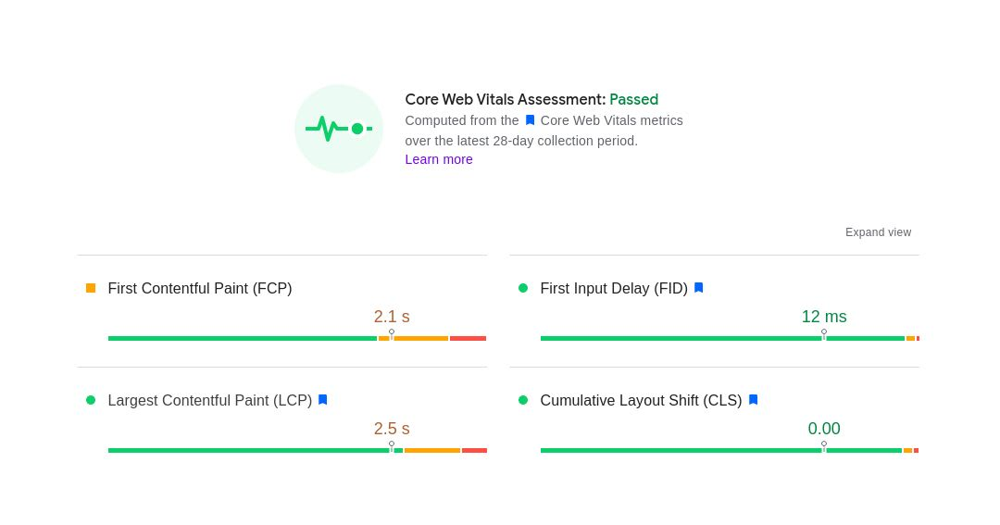
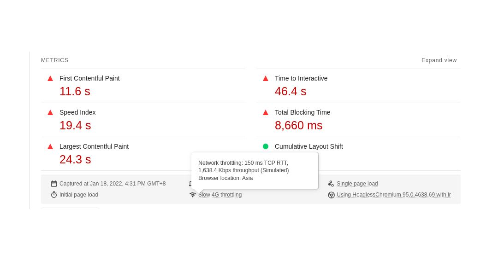
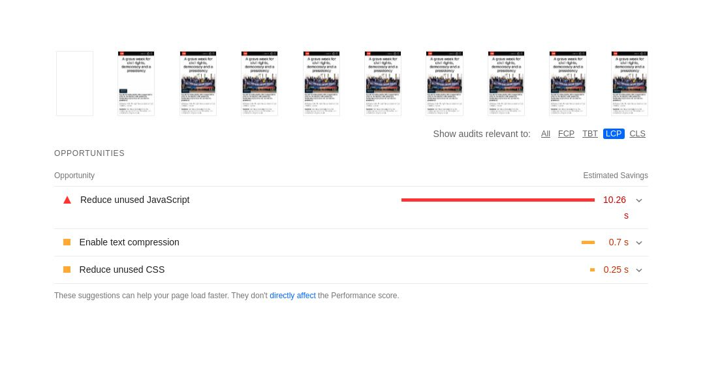

[PageSpeed Insights (PSI)](https://pagespeed.web.dev/) is a free tool from Google that allows anyone to gain performance insights for a web page across both desktop and mobile devices. In recent years real-user data from Google’s Chrome User Experience Report (CrUX) has also been added to test results when available.

The PSI test report also presents suggestions on how a page can be improved. Recent updates have also introduced framework specific suggestions. For example, if you test a page of a WordPress website you could be presented with some suggestions related to specific WordPress plugins or settings.

## Getting started

Head over to [https://pagespeed.web.dev/](https://pagespeed.web.dev/) and enter in a web page URL. Hit ‘Analyze’ and the tool will start running the page through emulated desktop and mobile Google Lighthouse tests.

## The results

After running a test, you’ll be taken to the results page. All results are separated into two tabs - Mobile and Desktop. By default, you’ll be shown the mobile results. This is because mobile results matter to Google, especially since we’re in the time of ‘mobile-first indexing’.

### Redirects

If the web page you entered gets redirected to another destination, PSI will show a small notice at the top of the test results. Since redirects can have a negative impact on performance, you’re given the chance to ‘Reanalyze’ the results.

### Real-user data

The first section of results shown are for real-user experiences on the page. The data presented here is from the CrUX report, for the past 28-days at the 75th percentile. Just a reminder that:

- The data is from sessions of Google Chrome users that have *opted in* to sharing this data with Google.
- The data excludes those using Chrome on iOS.
- If a page doesn't get a lot of traffic (enough for meaningful, anonymised data to be provided) then you won't see any results.

You’ll notice that there are two tabs within this section - This URL and Origin. If you test a page that has data for both, then you’ll be able to get a sense of how the page you’re testing compares with the rest of the website.

At the top of these results is a pass/fail rating, based on CrUX performance for Core Web Vitals metrics. To pass the Core Web Vitals Assessment, a page (or origin) must rank as “good” for all three Core Web Vital metrics.

Below this, you’ll be presented with details for how the page performs at the 75th percentile for each Core Web Vital metric. If you want to drill down further, there’s an “Expand view” toggle at the top right of this section. Clicking that will expand each Core Web Vital, and show a breakdown of page loads that fall into the “Good”, “Needs improvement”, and “Poor” buckets.

#### No data found

In the case that there’s not enough CrUX data available for the page you’re testing, you might still be able to get results in the Origin tab. While this is more generalised data, covering multiple pages across a domain, it can still be somewhat insightful.

If there’s no data in the Origin tab either, well move along down to the Lab results.

### Lab results

The next section (titled “Diagnose performance issues”) shows the results to Lighthouse performance audits run on the web page in simulated desktop and mobile environments.

The results here start with a headline performance score. You’ll be familiar with this If you’ve ever run a Lighthouse Audit on a web page. This score is a weighted calculation based on the key performance metrics measured in the simulated test.

Under this headline score you’ll see the results for each of the key performance metrics. Again, there’s an “Expand view” toggle to the right of this section. This time clicking it will reveal some more information about each metric.

#### Test conditions

Below this first set of results, you’ll see the conditions under which the test was run. Some details are underlined. Clicking on these will give some more information about the test environment.

It’s worth noting that PSI runs tests across four global datacenters based out of North America, Europe, and Asia. Where your test is run can impact performance results, especially if the page being tested isn’t served from a global CDN so it’s worth paying attention to this. Whenever I run tests from here in Taiwan, I find that I’m almost always getting results run from the Asia datacenter.

### Treemap

Under the test environment details, you’ll see a little button titled “View Treemap”. Clicking this will open a new tab, filled with squares of all different colours and sizes. Treemaps allow you to identify all the JavaScript that is download and used/unused by a page. Understanding and exploring treemaps is a whole topic on its own. If you want to get started, check out [Explore JavaScript Dependencies With Lighthouse Treemap](https://sia.codes/posts/lighthouse-treemap/) by Sia Karamalegos.

### Opportunities & diagnostics

Now onto the real handy part of the PSI test results. As part of the tests that PSI runs on a web page, it surfaces some recommendations to help make the page load faster. It’s worth noting the distinction between the opportunities and diagnostics sections.

- **Opportunities** - are suggestions to help the page load faster, and hopefully improve key performance metrics.
- **Diagnostics** - are additional information, gathered during the test run, that shows how the page stacks up to industry best practice.

For both, you may see framework specific suggestions to improve a page’s performance. You’ll see these if Lighthouse has been able to identify the framework used to build a page.

#### Opportunities

Each opportunity is presented alongside an estimate of how much faster a page might load if the optimisations are applied. Clicking on an opportunity will expand it, giving more details of the elements or code that is causing the test to fail. You’ll also get details on how to fix it, and links to Google articles so you can get started.

#### Diagnostics

Each diagnostic item can also be expanded. Doing show gives details on the elements that are causing the test to fail, as well as details on why/how to fix these.

#### Filtering results

A new additional to PSI is the ability to filter opportunities and diagnostics for individual Core Web Vitals. Doing so allows you to see the results that impact a particular metric, and be more detailed and methodical about applying fixes based on PSI results.

You’ll find the filter at the top right side of the Opportunities section, underneath the filmstrip that shows how your site loads. Clicking through the different metrics will surface only the results that are likely to have an impact on the chosen metric.

### Passing Audits

The final section of the test results is collapsed by default. Expanding it will show you all the audits which the page has passed. It’s always nice to see the number of passing audits rise as you work through addressing the opportunities and diagnostics for a given page.
