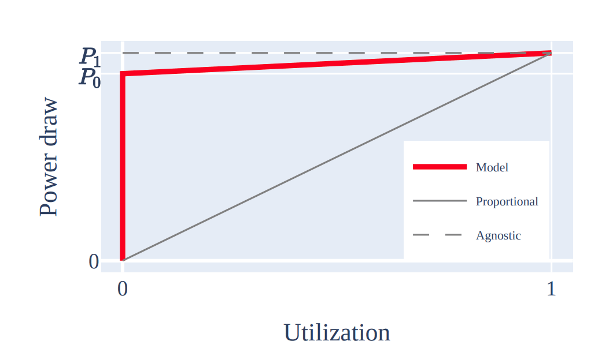

When I first started getting curious about digital sustainability, especially the carbon impact of my website, one of the first places I was pointed to was [Website Carbon Calculator](https://www.websitecarbon.com/). Being presented with a carbon impact for my small personal homepage was an eye opener.

That was a bit over two years ago. Since then, I’ve learnt (and am still learning) a heck of a lot about what goes into the carbon footprint of a website or digital service. Would I use Website Carbon Calculator when auditing a site now? Probably not. That said, I would still 100% recommend it, or [Beacon](https://digitalbeacon.co/), to anyone that’s looking at figuring out website carbon emissions for the first time.

## Data transfer is just the start

Most website carbon calculators look at the size of data transfer for a site or app and base calculations off that. At a high level, they’ll take the amount of data transferred and use constants to work out an estimated amount of energy consumed to transmit that data over the internet. This energy figure is then multiplied by a carbon intensity constant to return a carbon estimate.

Depending on the calculation model being used by the tool, there’ll be different assumptions made about the energy consumption of data, [system boundaries](https://www.wholegraindigital.com/blog/website-energy-consumption/), and even carbon intensity. Some might discount energy intensity for site’s using green web hosting, while others will not. Tools using the [Sustainable Web Design](https://sustainablewebdesign.org/calculating-digital-emissions/) model will also likely be making fixed assumptions about a website’s returning visitors & caching.

There are a fair few assumptions and generalisations being made there. Again, these tools make a great jumping off point for folks looking at digital carbon emissions for the first time. To get more accurate outputs, though, we need to start having tools that look beyond data transfer, and we need to start replacing some assumptions with more concrete inputs.

## Data transfer ≠ network energy usage

Wait, what?

Since I started looking into digital sustainability, I have always had the notion in my mind that the more data we send as part of a site or app, the more energy we consume on the network to transfer those bytes. Sticking with the theme of assumptions, I think it’s fair to say most people learning about digital sustainability would have similar thinking.

It is only recently that I became aware that this couldn’t be further from the truth. In fact, network devices are _always on_, and their energy consumption is generally independent of their traffic load. There’s a spike in energy consumption when the device is first turned on, and then its power usage stays relatively constant even as utilisation increases. The below graph illustrates this. It is taken from a paper titled [The Internet of tomorrow must sleep more and grow old](https://hotcarbon.org/pdf/hotcarbon22-jacob.pdf) by Romain Jacob and Laurent Vanbever. Romain gives a really nice summary of it in this [YouTube video](https://www.youtube.com/watch?v=EUprOJTvQ84).

### A moment to ponder

So, reducing the amount of data being transferred to load a website doesn’t really change the amount of energy required by networks to deliver it to users. Learning this left me questioning whether I’d been spending my time optimising for the wrong thing in the pursuit of more sustainable websites. I’d often explain to people that “by reducing the amount of data we move over the web we reduce the amount of energy the internet consumes”.

After thinking about this for a while, I’ve come to the conclusion that the data size still matters. Okay, it might not change how much energy the network consumes. But, data in 1’s and 0’s still needs to be processed either by a server or a client, or maybe both. And it can still have a significant impact on performance as well. So, yes, I’ll still be optimising for less bytes whenever possible.

What’s required, however, is a shift in how we think about the impact of data transfer, and where we focus. To do this, we need flexibility in our carbon estimation models.

## So, where to from here?

With network energy usage being fixed, that’s [around 14% of the total energy usage](<https://sustainablewebdesign.org/calculating-digital-emissions/#:~:text=Network> use%3A data transferred across the network. This accounts for an estimated 14%25 of the system.) for a digital product that we can’t change. Instead, where should we focus our efforts? What variables can we measure that can help deliver more detailed digital carbon results?

### Measure at the server

Variability of server load would be the first place to start. This isn’t _as easy_ as it might seem. For those of us who rely on services like Netlify or Vercel to get our sites online, getting server resource utilisation isn’t possible (as far as I know). There may be WordPress hosts, or other hosting providers, out there that do provider this level of information in some kind of dashboard. If you know of any, please do let me know!

If you’re using cloud functions or serverless, most of the large providers now have dashboards or reports that surface some level of energy/carbon related data. There can be a degree of ambiguity to some of the data, though, with providers claiming “commercial secrets” could be revealed if certain information is made public. If you’d like to get the data yourself, you can look into using [Cloud Carbon Footprint](https://www.cloudcarbonfootprint.org/) instead.

Finally, if you run your own servers on premise then you should have all the data on hand by comparing your energy bill with server utilisation. You can then use [grid intensity data for your country](https://github.com/thegreenwebfoundation/co2.js/tree/main/data/output) to work out the carbon emissions of your on-premise operations. Alternately, you could try asking your energy provider for your grid intensity data.

### Measure on the device

Loading and consuming anything on a device (desktop, laptop or mobile) draws power. So, the next place to look is how the data required to load our website, app, or service is impacting a user’s device itself. Now, there are a bunch of gotchas and edge cases here which I won’t go into in detail for this post (e.g. I am using my phone unplugged, but it was charged when the grid was using mostly renewable electricity).

Firefox browsers now include [device power usage data in their developer tools profiler results](https://www.mozilla.org/en-US/firefox/104.0/releasenotes/) (Windows & Mac only). This is very useful in gaining insights into how much power a site or app is utilising both when it is in standby and also actively being used. The data is displayed on a timeline track, and you can zoom in on parts of it. This means it could be possible to estimate the impact of a particular action on a site or app too!

This level of granular data is priceless in working out more accurate carbon estimates. In fact, there’s even [a pull request open](https://github.com/firefox-devtools/profiler/pull/4243) to display carbon estimates alongside these power usage results. The PR uses the global annual average grid intensity for now. Ideally, though, you’d want to take power consumption and multiply it by a grid intensity value for the country/region in which that device is being used.

As for other browsers, Safari’s power meter provides guidance without returning any detailed figures. Meanwhile, the team at Microsoft Edge are looking to get some [sustainability metrics into their DevTools](https://fershad.com/writing/microsoft-propose-sustainability-section-in-edge-devtools/) (which should hopefully mean all Chromium browsers get it too).

### Adjust usage assumption

I mentioned earlier that the Sustainable Design Model includes assumptions about return visitors to a site, and data caching on the device. In most cases, we actually know (or can find) this information for our own websites or apps. If you’re using the Sustainable Web Design model as the basis for a carbon audit, then you’d want to replace their assumptions with your own figures at the very least.

This has been [raised as an issue](https://github.com/thegreenwebfoundation/co2.js/issues/109) for the Sustainable Web Design implementation in CO2.js, and it’s something I’m very keen to get working on.

### Better production data

Finally, looking at the full lifecycle of our products can be a big undertaking but is critical to generating the most accurate overall results. It would be a whole post in to go into working out the lifecycle carbon footprint of a device. All I’ll say for now is that it would be great to see manufacturers make carbon/environmental impact data about a device readily available to consumers. This [example from HP Enterprise](https://www.hpe.com/psnow/doc/a50002430enw) (page 2 of the PDF) presents the information in a really easy to digest form If this kind of information was available in store/online when buying a device, as well as on a manufacturer’s website it would help us include more detailed device lifecycle impact data into our estimates.

## What does all this mean?

My personal take is that we’ll see a lot of movement in how digital carbon estimates are calculated in the next year. This will come as a result of access to more granular data, coupled with a better understanding of how different parts of the system operate & come together. We’ll probably see a shift away from generic, average based figures towards more case specific results that provide a truer reflection of the impact of digital.
