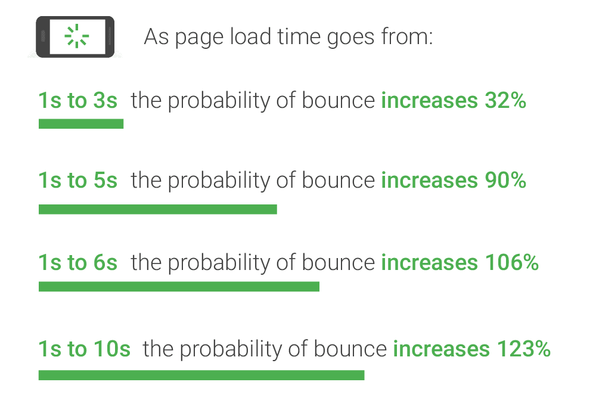

This is the fifth post in a series where I'll outline the benefits that can be derived through website optimisation. Not only will we touch on monetary aspects, but we'll also get into environmental impact, and customer experience.

You can read the other posts in this series using the links below (they'll be at the end of this post too):

1. [Increase conversions (or engagement)](https://www.fershad.com/blog/posts/website-optimisation-increase-conversions-engagement/)​
2. [Reduce operational costs​](https://www.fershad.com/blog/posts/website-optimisation-reduce-operational-costs)​
3. [Reduce environmental impact​](https://www.fershad.com/blog/posts/website-optimisation-reduce-environmental-impact)
4. [Improve your search ranking​](https://www.fershad.com/blog/posts/website-optimisation-improve-search-ranking)
5. **Deliver a better user experience​ - This post**​

Now, let's get onto how optimising your site can help you leave a lasting first impression on visitors, and boost the chances of them coming back.

## We're all busy (or at least it seems)

People value their time. Sometimes it feels like there's an ever growing list of tasks that need to be accomplished, and not enough hours in the day to get them done. For some, hustle is life. Increasingly people are surfing the web on their phones, while commuting, or trying to perform multiple tasks at once (just don't use your phone and drive, please). They want information quickly, they want to be able to browse, decide, and purchase in a minute. So yeah, speed is important.

Indeed, Google’s own research has shown that the longer website visitors must wait for content to load and be interactive, the more likely they are to “bounce” or abandon the website.

## Online user experience = customer experience

Having a website that loads fast and allows visitors to interact with it quickly allows you to deliver a better customer experience. The impression this leaves on your customers can be the difference between them making a purchase or not. It can also result in them being more likely to recommend your site to their friends.

This is backed by a survey of online shoppers by Kissmetrics. Their study found:

- 52% of shoppers said web pages loading quickly were important to their site loyalty.
- There was a 16% decrease in customer satisfaction for each 1 second of delay in page load.
- 44% of shoppers would tell their friends about poor online experiences.

The [report is from 2011](https://blog.kissmetrics.com/wp-content/uploads/2011/04/loading-time.pdf) but hey wasn't it a simpler, dare I say less demanding, time way back then?

Some other ways to think about how web performance equates to customer service are through the hypotheticals below:

- Someone has come to your website because they want to find information or want to purchase something. In a physical store you would want to make it as easy as possible for your customer to make that purchase/get that information, right? The same should apply online.
- With more and more people using their mobile phone to surf the web you cannot rely on your visitors having unlimited bandwidth or be running 4G or 5G connections. A lot of people will be on capped data plans, 3G or slower connections, and are likely not using the latest, fastest Apple or Android phone. Serving them a web page that's bloated, processor intensive, or not even optimised for mobile screens leads to a poor customer experience. Heck, the visitor to your site might not come back, and might tell others to avoid your site too.

## How can you improve?

If you've read all the previous posts, you've probably got a pretty good idea of where to start. By just [doing the basics well](https://www.fershad.com/blog/posts/web-performance-quick-guide/), you'll put yourself ahead of the majority of websites out there. Heck, you could even have a nosey around your competitors websites to see how they stack up. Run your site and theirs through [Google Lighthouse](https://web.dev/measure/). It might present a surprising opportunity for you to gain a competitive edge.
